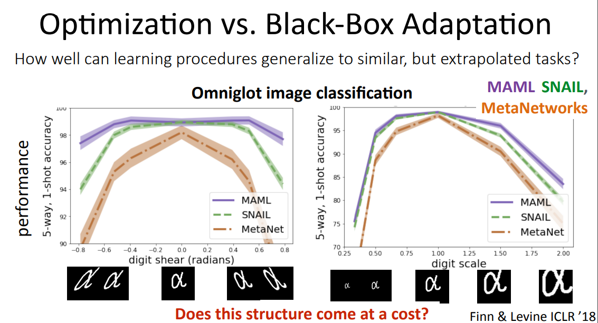

# 4 Lecture. Optimization-based Meta Learning (MAML)

> Organization: 가짜연구소 (Pseudo Lab)
> Editor: 이홍규
> 강의 자료: [CS330 2020 Fall](http://cs330.stanford.edu/fall2020/slides/cs330_lecture3.pdf)
> 강의 영상: [Youtube](https://www.youtube.com/watch?v=2a_LSOIlHLI&list=PLoROMvodv4rOxuwpC_raecBCd5Jf54lEa&index=4)

## 알고리즘 오버뷰

Optimization-based Meta Learning의 알고리즘은 다음과 같이 정의할 수 있습니다.

1. <mark>해당 태스크의 support set $(\mathbf x_i^\text{spt}, y_i^\text{spt})$을 **gradient descent** 시킴으로써</mark>  **task-specific parameter vector** $\phi_i$를 얻는다. 

$$
\Large
\phi_i \leftarrow  
\theta - \alpha \times \nabla_\theta \mathcal{L}\left(y_i^\text{spt}, f(\mathbf x_i^\text{spt}; \theta)\right)
$$

$$
\alpha : \text{Update rate} \\
\mathcal L : \text{Loss function}\\
(\mathbf x^\text{spt}, \mathbf y^\text{spt}) : \text{Support set}
$$

2. 그렇게 얻은 task-specific parameter를 통해 본격적으로 쿼리셋($\mathbf x^\text{qry}$)에 대한 inference를 수행한다.

$$
\Large
\theta^*\leftarrow \theta - \beta \times \nabla_\theta \mathcal L(\mathbf y_i^\text{qry}, f(\mathbf x_i^\text{qry};~\phi_i))
$$

$$
\beta : \text{Meta-learning rate} \\
\mathcal L : \text{Loss function}\\
(\mathbf x^\text{qry}, \mathbf y^\text{qry}) : \text{Query set}\\
\theta^* : \text{Updated theta}
$$

이해를 돕기 위해 pseudo-code를 참고해보도록 하겠습니다.

```python
# Pseudo Code 1
for x_spt, y_spt, x_qry, y_qry in tasks:
    y_spt_pred = f(x_spt, θ)
    spt_loss = loss(y_spt, y_spt_pred)
    ϕ_i = θ - α*grad(spt_loss, θ)

    y_qry_pred = f(x_qry, ϕ_i)
    qry_loss = loss(y_qry, y_qry_pred)
    θ = θ - β*grad(qry_loss, θ)
```

```python
# Pseudo Code 2 (pytorch api)
meta_optim = optim.Adam(θ, lr=β)

for x_spt, y_spt, x_qry, y_qry in tasks:
    meta_optim.zero_grad()
    y_spt_pred = f(x_spt, θ)
    spt_loss = loss(y_spt, y_spt_pred)
    ϕ_i = θ - α*grad(spt_loss, θ)

    y_qry_pred = f(x_qry, ϕ_i)
    qry_loss = loss(y_qry, y_qry_pred)
    qry_loss.backward()
    meta_optim.step()
```


## 문제점과 대안

하지만 기본적으로 <mark>vanilla MAML은 **과중한 컴퓨팅 코스트**를 유발합니다.</mark> 그래디언트 디센트로 얻은 task specific parameter를 통해 얻은 최종 Loss를 또 다시 그래디언트 디센트를 하기 때문입니다. 이 문제를 해결하기 위한 어프로치는 다음과 같습니다.


__1. $\cfrac{d\phi_i}{d\theta}$를 $I$로 간주하기__<div id="cp1"></div>

최종적으로 우리가 계산하는 그래디언트($\nabla_\theta \mathcal L$)는 [chain rule](https://en.wikipedia.org/wiki/Chain_rule)에 따라 다음과 같이 decompose할 수 있습니다.

$$
\nabla_\theta \mathcal L \left(\mathbf y_i^\text{qry},
f(\mathbf x_i^\text{qry}, \phi_i)\right)  \\
= \cfrac{d}{d\theta} \mathcal L \left(\mathbf y_i^\text{qry},
f(\mathbf x_i^\text{qry}, \phi_i)\right) \\
= \cfrac{d \mathcal L}{d\phi_i} \cfrac{d\phi_i}{d\theta}
$$

그리고 여기서 $\cfrac{d\phi_i}{d\theta}$를 $I$로 간주하게 된다면, 우리는 $\cfrac{d\mathcal L}{d\phi_i}$를 $\nabla_\theta \mathcal L$로 취급하겠다는 이야기가 됩니다. 그리고 $\cfrac{d\mathcal L}{d\phi_i}$를 계산하는 것은 그냥 일반적으로 supervised learning에서 그래디언트를 계산하는 것과 다를 바가 없어 컴퓨팅 코스트가 낮습니다.  *(반면, $\cfrac{d\mathcal L}{d\theta}$를 계산하는 것은 컴퓨팅 코스트가 매우 큽니다!)*

물론 $\cfrac{d\phi_i}{d\theta} \approx I$는 굉장히 무식한 approximation처럼 보일 수 있습니다. 하지만 Chelsea Finn 교수님의 말씀에 따르면, 심플한 퓨샷 태스크에서는 잘 동작한다고 합니다. 다만 태스크의 난이도가 복잡해지면 좋은 효과를 기대하기가 어렵다고 합니다.


__2. 헤드 부분만 옵티마이즈하기__

모델 파라미터 전체를 task-specific 파라미터로써 그래디언트 디센트하는 것이 아니라, 모델의 헤드 부분(*모델의 마지막 레이어*)만을 task-specific 파라미터로써 그래디언트 디센트한다면 이것 역시 컴퓨팅 코스트를 줄일 수 있는 좋은 대안이 될 수 있을 것입니다.


## Appendix A: `create_graph=True` (PyTorch)

파이토치의 [`backward`](https://pytorch.org/docs/stable/generated/torch.autograd.backward.html#torch-autograd-backward) 메서드나 [`autograd`](https://pytorch.org/docs/stable/generated/torch.autograd.backward.html#torch-autograd-backward)함수에는 `create_graph=True`라는 옵션을 설정할 수 있습니다. `create_graph`를 `True`로 설정되면 `autograd`를 통해 계산된 그래디언트 벡터에서도 computation graph가 계속 이어집니다!  이를 통해 task-specific parameter $\phi_i$를 계산하고, 다시 그걸 바탕으로 최종 Loss ($\mathcal L(\mathbf y_i^\text{qry}, f(\mathbf x_i^\text{qry};~\phi_i))$)를 산출하고 거기서 다시 backward를 실행해도 정상적으로 back-propagating이 원래의 파라미터 $\theta$에까지 전달될 수 있습니다.


:::{admonition} `create_graph` 옵션의 디폴트가 `False`인 이유 
:class: tip

`create_graph` 옵션의 디폴트는 `False`입니다. 일반적인 supervised learning task에서는 그래디언트 벡터에서 추가적으로 computational graph를 계속 이어갈 이유가 없기 때문입니다.

:::


> With `create_graph=True`, we are declaring that we want to do further operations on gradients, so that the autograd engine can create a backpropable graph for operations done on gradients.
>
> `retain_graph=True` declares that we will want to reuse the overall graph multiple times, so do not delete it after someone called `.backward()`. From looking at the code, we do not call `.backward()` on the same graph again, so `retain_graph=True` is not needed in this case.
>
> [source: Soumith Chintala in PyTorch Discussion](https://discuss.pytorch.org/t/when-do-i-use-create-graph-in-autograd-grad/32853)


## Appendix B: Black-box Meta Learning vs. MAML



[source: CS330](https://www.youtube.com/watch?v=2a_LSOIlHLI&list=PLoROMvodv4rOxuwpC_raecBCd5Jf54lEa&index=4)

* 위의 자료를 보면 결국 MAML은 데이터 왜곡에 좀 더 robust한 것으로 나타납니다. 
* 해당 태스크의 서포트셋을 gradient descent를 통해 학습하기 때문에, 기존 분포에 벗어난 데이터에도 블랙박스 메타러닝 모델들에 비해 robust한 경향을 보이는 것 같습니다.


## Appendix C: Reptile


위의 Reptile 알고리즘은 [앞서 언급했던 $\cfrac{d\phi_i}{d\theta} \approx I$ 로 간주해서  $\cfrac{d\mathcal L}{d \phi_i} \approx \nabla_\theta \mathcal L \left(\mathbf y_i^\text{qry},
f(\mathbf x_i^\text{qry}, \phi_i)\right)$라는 근사식을 얻는 알고리즘](#cp1)과 유사한 접근방법 같습니다. Reptile에서는 $\phi_i - \theta$를 그래디언트 $\nabla_\theta \mathcal L \left(\mathbf y_i^\text{qry},
f(\mathbf x_i^\text{qry}, \phi_i)\right)$로 취급합니다. 사실 구체적인 수학적 유도 과정이 있기는 한데, 이건 나중에 기회가 되면 다뤄볼까 합니다.


## 참고자료들

1. [“dragen1860/MLML-Pytorch”](https://github.com/dragen1860/MAML-Pytorch)(github). Retrieved October 06, 2022.
2. Chelsea Finn(2020). [“Stanford CS330: Deep Multi-task & Meta Learning | 2020 | Lecture 4 - Optimization Meta-Learning”](https://www.youtube.com/watch?v=2a_LSOIlHLI&list=PLoROMvodv4rOxuwpC_raecBCd5Jf54lEa&index=4) (YouTube). Retrived October 05, 2022.
3. Chelsea Finn, Pieter Abbeel, Sergey Levine (2017). [“Model-Agnostic Meta-Learning for Fast Adaptation of Deep Networks”](https://arxiv.org/abs/1703.03400).
4. Justin Domke (2009). [“Hessian-Vector products”](https://justindomke.wordpress.com/2009/01/17/hessian-vector-products/)

5. ["When do I use `create_graph` in autograd.grad()"](https://discuss.pytorch.org/t/when-do-i-use-create-graph-in-autograd-grad/32853) (PyTorch Discuss)

6. Open AI  (2018). ["Reptile: A Scalable Meta- Learning Algorithm"](https://openai.com/blog/reptile/)
