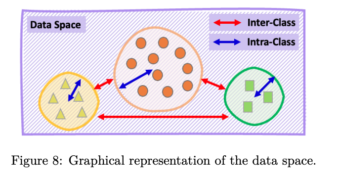
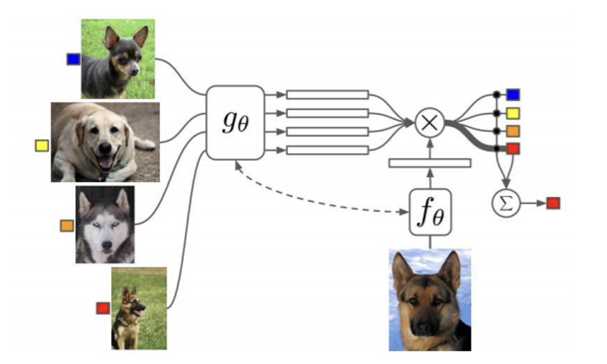
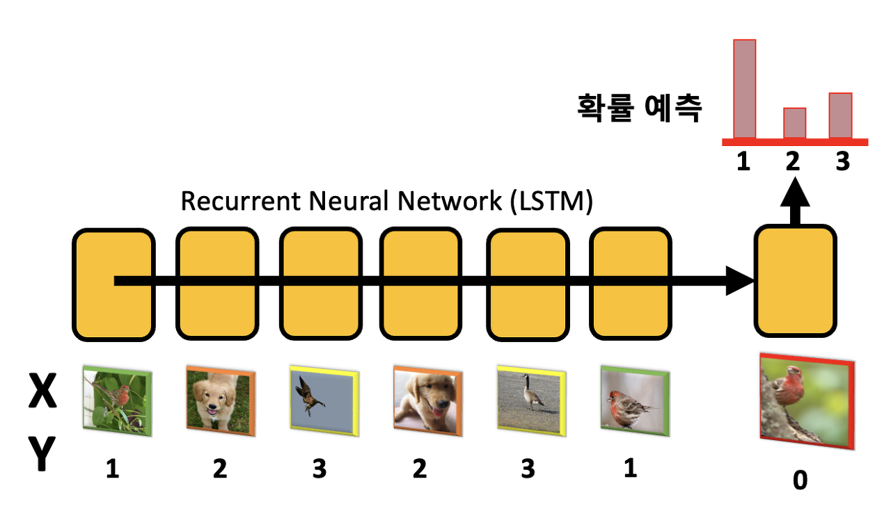
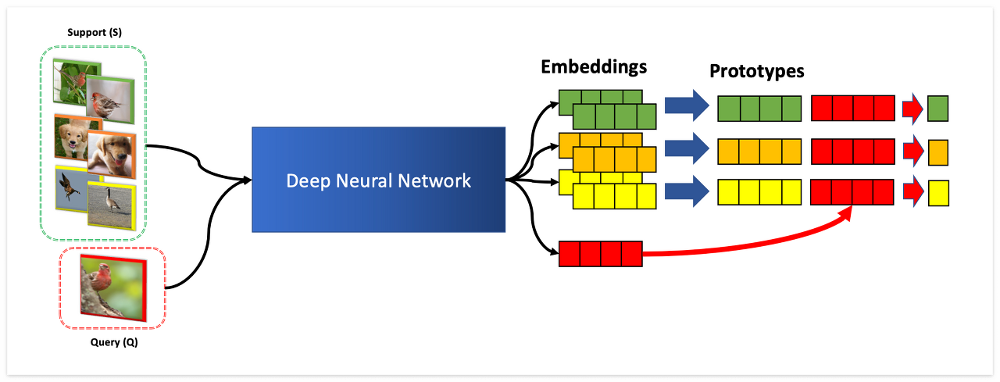

# Lecture 6. Non-Parametric Few-Shot Learning

>Organization: 가짜연구소 (Pseudo Lab)  
>Editor: [Bumjin Park](https://github.com/fxnnxc)  
>강의 자료: [CS330 2020 Fall](http://cs330.stanford.edu/fall2020/slides/cs330_nonparametric_2020.pdf)  
>강의 영상: [Youtube](https://www.youtube.com/watch?v=ARQI7USUo5w&list=PLoROMvodv4rOxuwpC_raecBCd5Jf54lEa&index=5)  

안녕하세요, AI대학원 석사과정 박범진입니다. 다양한 분들과 열심히 배우고 정보를 공유하고 싶은 마음에 스터디에 참여하였습니다. <br/>
부족한 점도 많지만, 열심히 준비하여 많은 분들께 도움이 되었으면 하는 바람입니다. 감사합니다. 


### **Metric 기반 메타러닝**

메타러닝은 크게 Gradient 기반과 Metric 기반으로 나뉩니다.  포스팅에서는 Metric 기반 메타러닝 알고리즘을 알아보겠습니다. 여기서 말하는 Metric이란 데이터 사이의 거리는 재는 것을 나타내는 것으로 거리가 가깝다면 비슷한 클래스, 반대로 멀리 떨어진 경우 다른 클래스로 분류하고자 합니다. 데이터 클래스에 대해서 Metric은 🔖 **Intra-Class** 와 🔖 **Inter-Class** 두 가지로 고려 될 수 있습니다. 

-   **🔖 inter-Class** : **클래스 끼리** **거리 (붉은색)**
-   **🔖 intra-Class : 클래스 내부 데이터 사이의 거리 (파란색)**




Metric 기반 메타러닝에서 중요한 것은 주어지는 적은 양의 데이터에 대해서 🔖**Inter-class** 를 잘 구분하는 것입니다. 이를 위해서 클래스에 대해서 데이터를 저차원의 공간으로 맵핑시키도록 학습하고자 합니다. 아래 그림과 같이 🔖**Support 데이터**가 있다면, 🔖**Query 데이터**는 Support의 클래스 중에서 제일 가까운 클래스로 예측하게 됩니다. 이 때 사용되는 🔖**Encoder** 는 보통 파라미터 Sharing 모델을 사용합니다. 


---

## **Metric-based Meta Learning Algorithms**

Metric 기반 알고리즘 **4가지를 살펴보겠습니다**. (물론 종류는 더 있습니다)

-   **🚀 Matching Network (MN) :** 클래스 별 샘플 1개의 Support 데이터 넣고, Query 넣고 비교
-   **🚀 Memory Augmented Neural Networks** : LSTM에 Sequential 하게 (X,y)를 넣고, Query x에 대해서 예측 
-   🚀**Prototypical Networks (ProtoNet)**  : 동일한 클래스에 해당하는 샘플 여러개를 평균내서 비교 
-   🚀**Relation Network (RN) :** 동일한 클래스에 해당하는 샘플들을 평균내고, Query랑 Concat해서 Score 예측

---

### **🔖 Match Network**

Match Network 의 기본은 하나의 샘플에 대해서 비슷한 정도를 측정하는 것을 목표로 합니다. 한 가지 문제는 여러 개의 샘플이 있을 때 어떻게 해야 하는지 나와있지 않습니다. 왜냐하면 원래 논문이 🔖 **One-shot learning** (하나의 샘플을 주고 클래스 예측)을 목표로 하기 때문입니다. [논문링크 : Matching Networks for One Shot Learning, Vinyals et al, 2016](https://arxiv.org/abs/1606.04080)




해당 모델을 One-shot 에서 K-shot 으로 일반화한 모델이 ProtoNet이니, 더 자세한 내용은 밑에 ProtoNet에서 설명하겠습니다. 

---

### 🔖**Memory Augmented Neural Network**

Main Idea는 🔖 **Recurrent Neural Network** 로 정보를 저장하는 것 입니다. 🔖 **Support Data**에 대해서는 클래스 Y 를 같이 입력으로 주고, 🔖 **Query**에 대해서는 Mask 값을 주고 클래스에 대해서 확률을 예측하는 방식으로 모델을 학습합니다. 





---

### 🔖**Prototype Network**

Matching Network 가 One-shot Leanring 을 목표로 했다면, ProtoNet은 🔖 **K-shot Learning** 을 목표로 합니다. K-shot Learning 은 각 클래스 별로 K개의 샘플을 주는 것 입니다. 아래 그림과 같이 Support 데이터에 대해서 Prototype (프로토타입 = 대표샘플) 을 만들어서 Query 와 비교하는 방식입니다. 


그림에서 클래스 별 Prototype $c\_n$ 은 클래스 별로 샘플을 평균내서 계산됩니다. 


이렇게 계산된 클래스별 Prototype은 이제 Query 데이터와 🔖 **Softmax**를 통해서 확률값으로 계산됩니다.

가장 높은 확률을 가지는 클래스를 선택하게 됩니다. 레이블 (0,1,2,3) 등과 같은 값은 필요가 없습니다.

Prototype 위치에 대한 하는 값을 반환하면 되기 때문입니다. 


**아래 코드는 Pytorch Implementation 입니다.** 

```python
# deep learning encoding 
support_x = self.forward(support_x)
query_x = self.forward(query_x)

# check the number of classes
unique_classes = torch.unique(support_y)

class_samples = [] 
query_y_clone = query_y.clone().detach()

# select the samples for each class
for idx, class_index in enumerate(unique_classes):
    class_sample_indices = support_y == class_index
    support_class_x = support_x[class_sample_indices]
    support_class_y = support_y[class_sample_indices]
    query_y[query_y_clone == class_index] = idx
    class_samples.append(support_class_x)

# mean pooling to make prototypes 
prototypes = torch.stack([batch.mean(0) if batch.ndim > 1 else batch for batch in class_samples])
similarity = self.distance_function(query_x, prototypes)
logits = torch.softmax(similarity, dim=-1)

loss = self.loss(logits, query_y)
acc = (logits.argmax(dim=-1) == query_y).sum().detach() / len(query_y)
```

---

### 🔖**Relation Network**

ProtoNet과 다른 점은, Softmax 로 계산하기보다 Prototype 과 Cocat을 하여 Score를 계산하는데 있습니다. 한 가지 장점은 Prototype과 Query 의 Representation 을 한단계 더 해석할 수 있다는 점 입니다. (ProtoNet 은 바로 확률값으로 나오는 차이점)



해당 그림과 같이 Query Embedding은 Prototype과 붙여서 Score값을 마지막에 내보내게 되고, 이를 기반으로 가장 높은 클래스가 선택됩니다. Metric 기반 Meta Learnin 은 데이터의 표현공간에 대한 차이를 기반으로 예측한다는 점에서 🔖 **Self-Supervised Learning**이나 🔖 **Pretrained Model** 을 결합하여 사용하는 경우, 월등히 높은 성능을 내게 됩니다. 🔖 **Metric-based Meta Learning** 알고리즘의 요점은 샘플을 비교하는 방식을 논의하는데 있습니다.