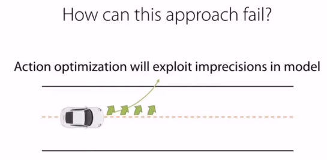
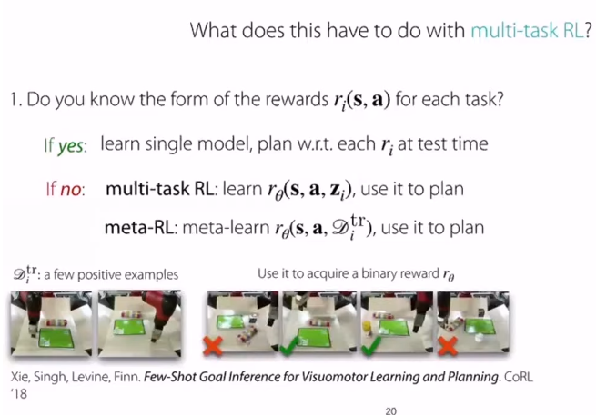

# Lecture 10. Model-Based RL

>Organization: 가짜연구소 (Pseudo Lab)  
>Editor: [이홍규](https://github.com/howsmyanimeprofilepicture) 
>강의 자료: [CS330 2020 Fall](http://cs330.stanford.edu/fall2020/slides/cs330_mbrl_2020.pdf)  
>강의 영상: [Youtube](https://youtu.be/LGhVQ3NB9h4)
## 개요

* Model-based RL의 주된 모티베이션은 **충분한 양의 데이터 확보**입니다.
* 실제 시스템을 동작함해서 얻은 데이터는 품질은 완벽하지만, 그 양이 모델을 충분히 generalization하기에는 부족할 수밖에 없습니다.

:::{admonition} Example
:class: important
예를 들어 참다랑어 스시를 만드는 로봇을 구현한다고 가정합시다. 고추냉이가 너무 들어가서 먹으면서 눈물을 쏟는 스시도 있을 것이고, 밥이 너무 많이 들어가고 참다랑어는 눈꼽만큼 올려져 있는 스시도 있을 것입니다. 모든 형태의 스시(state)를 실제 로봇을 동작해서 표현하려고 한다면, 그건 로봇도 힘들고, 수 많은 참다랑어가 소비되어야 합니다. 
:::

* 따라서 <mark>실제 환경의 transition dynamic ( $p(s'|s,a)$ ) 을 모델 ( $f_\phi(s,a)$ )을 통해 시뮬레이션</mark>하고, 이를 통해 데이터의 부족을 해결해보자는 접근방법이 **Model-based RL**이라고 할 수 있습니다. 

* 다이나믹 모델은 stochastic하게 구현될 수도 deterministic하게 구현될 수도 있습니다. 
* 모델은 일반적으로 아래와 같이 일반적인 supervised learning의 형태로 fitting됩니다. 

$$
\mathcal D = \{(s_i, a_i, s'_i)|i=1,~\cdots,~N~\}\\
\min_\phi \sum_i ||f_\phi(s_i, a_i) - s_i'||^2
$$

* 여기서 모델은 현재 state와 action을 전달받고 다음 state의 distribution을 예측하도록 피팅됩니다.

$$
f_\phi(s, a) = p(s'|s,a)
$$

## 문제점  

먼저 Model-Based RL은 다음과 같이 동작합니다. 

:::{admonition} Peudo-Code
:class: note
1. 어떠한 폴리시(e.g. random policy)를 통해 실제 환경으로부터 데이터를 수집합니다. $\mathcal D = \{(o_i, a_i, o'_i)\}$
2. 해당 데이터를 통해 모델을 피팅합니다. $s' = f_\phi(s,a)$.
3. 해당 모델을 통해 $f_\phi(s, a)$, 최적의 액션 시퀀스를 산출합니다.
:::

[source](https://youtu.be/LGhVQ3NB9h4?list=PLoROMvodv4rOxuwpC_raecBCd5Jf54lEa&t=1749)

* 하지만 아무리 실제환경을 잘 피팅했다고 해도 <mark>모델에는 어느 정도의 오차가 존재합니다. </mark>
* 그리고 액션이 길어질수록 이 에러들이 쌓이면서 나중에는 무시하지 못할 수준이 될 수 있습니다.
* 이와 같은 문제의 경우, 모델이 생성한 데이터를 다시 모델 피팅에 사용함으로써 어느 정도 완화할 수 있습니다.
* 해당 알고리즘은 **MPC**(model-predictive control)라고 불립니다.

[source](https://youtu.be/LGhVQ3NB9h4?list=PLoROMvodv4rOxuwpC_raecBCd5Jf54lEa&t=1913)

:::{admonition} Peudo-Code
:class: note
1. 어떠한 폴리시(e.g. random policy)를 통해 실제 환경으로부터 데이터를 수집합니다. $\mathcal D = \{(o_i, a_i, o'_i)\}$
2. 해당 데이터를 통해 모델을 피팅합니다. $s' = f_\phi(s,a)$.
3. 해당 모델을 통해 $f_\phi(s, a)$, 최적의 액션 시퀀스를 산출합니다.
4. 산출된 최적의 액션 시퀀스에서 첫번째 액션만을 실행하고 나머지는 버립니다.
5. 액션 실행 결과로 얻은 데이터 $(s,a,s')$를 데이터셋에 추가합니다.
6. 2번으로 돌아갑니다.
:::

## Multi-task RL

* 강화학습 태스크는 다음과 같이 정의됩니다.

$$
\underbrace{\mathcal T_i}_\text{task} 
\triangleq \{\mathcal S_i,~
\mathcal A_i,~
p_i(s_1),~
p_i(s'|s,a),~
r_i(s,a)\}
$$

* $\mathcal S_i$ : state space
* $\mathcal A_i$ : action space
* $p_i(s_1)$ : distribution of initial states
* $p_i(s'|s,a)$ : transition dynamics or transition probability
* $r_i(s,a)$ : reward

* 하지만 많은 경우에서, 오직 <mark>**리워드**만이 태스크를 구분하는 요소</mark>가 되곤 합니다. 
* 예를 들어 다양한 태스크를 수행하는 로봇을 만든다고 했을 때, 해당 로봇이 가질 수 있는 State와 Action은 태스크와 무관하게 동일할 것입니다. 
* 하지만 해당 로봇은 태스크에 따라 리워드는 당연히 다를 것입니다.

:::{admonition} Example
:class: important
예를 들어 스테이크를 굽는 로봇을 구현한다고 가정합시다. 스테이크가 완전히 속까지 익을 정도로 구어졌다면, 레어로 굽는 태스크에서는 리워드가 마이너스 혹은 0이겠지만, 웰던으로 굽는 태스크에서는 좋은 리워드를 받을 것입니다.
:::

[source](https://youtu.be/LGhVQ3NB9h4?list=PLoROMvodv4rOxuwpC_raecBCd5Jf54lEa&t=2006)

* 각 태스크별로 reward function의 형태를 알고 있는 경우, 해당 reward function에 기반해, 해당 태스크에 맞게, 액션을 플래닝하면 될 것입니다.
* 하지만 태스크에 따른 reward function의 형태를 모를 경우, 우리는 태스크 별 reward function을 추정해야 할 것입니다.
* 이 때 앞서 배웠던 Multi-task Learning, 그리고 Meta Learning 방법론이 사용될 수 있습니다.
* 위 이미지에 Meta Learning을 통해 reward function을 학습시키는 어프로치가 소개되어 있는데, 2개의 Positive example만 주어진 채로, (state, action) 튜플 4개에 대해 binary한 reward를 추정하도록 훈련시키고 있습니다.

## Latent Representation

* Model-based RL에서 자주 사용되는 어프로치 중에 하나는 observation을 상대적으로 더 낮은 차원의 latent space로 임베딩하는 것입니다.

$$
s = g(o)
$$

* 알고리즘을 살펴보면 다음과 같습니다.

:::{admonition} Peudo-Code
:class: note
1. 어떠한 폴리시(e.g. random policy)를 통해 실제 환경으로부터 데이터를 모읍니다. $\mathcal D = \{(o_i, a_i, o'_i)\}$
2. 인코더($g$)를 통해 observation들을 임베딩하고 — $s = g(o)$ — 임베딩된 state들을 기반으로 모델을 피팅합니다. — $s' = f_\phi(s,a)$.
3. 모델($f_\phi(s, a)$)을 통해 최적의 액션 시퀀스를 산출합니다.
4. (추가적으로 MPC등이 도입될 수도 있을 것입니다.)
:::

* 이러한 어프로치에서 우리는 리워드를 다음과 같이 정의할 수 있습니다.

$$
r(o_i, a_i) = -||g(o_i') - g(o_\text{goal})||^2
$$

$$
r(s_i, a_i) = -||s'_i - s_\text{goal}||^2
$$

* 주의할 점은, 임베딩된 스테이트가 정보를 잘 표현하고, 원래의 이미지로의 reconstruction도 잘 된다해도, <mark>반드시 state간의 L2 distance가 observation간의 유사도를 표현한다고 보장할 수는 없다</mark>는 것입니다.
* 따라서 이와 같이 L2-distnace를 기반으로 리워드를 정의할 경우, L2-distance가 스테이트 간의 유사도를 표현할 수 있도록 옵저베이션을 임베딩해야 합니다.

$$
s_i \leftarrow g_\text{enc}(o_i;~\theta_\text{enc}) \\
\hat o_i \leftarrow g_\text{dec}(s_i;~\theta_\text{dec}) \\

\theta_\text{enc} \leftarrow \arg\min_{\theta_\text{enc}} 
\sum_i||\hat o_i -o_i||^2 \\
\theta_\text{dec} \leftarrow \arg\min_{\theta_\text{dec}} 
\sum_i||\hat o_i -o_i||^2
$$

* 또한 우리는 **Reconstruction Error**를 고려해서, 모델뿐만이 아니라 옵저베이션을 임베딩하는 <mark>**인코더**와 **디코더**도 피팅해야합니다.</mark> 

* 단순히 임베딩된 스테이트만을 사용해서 모델을 피팅한다면,
* Encoder가 Trivial Solution —e.g., 모든 observation을 zero vector로 임베딩 — 을 산출할 수 있기 때문입니다.

## 참고 자료

* Manuel Watter, Jost Tobias Springenberg, Joschka Boedecker, and Martin Riedmiller (*2015*). ["Embed to Control: A Locally Linear Latent Dynamics Model for Control from Raw Images"](https://arxiv.org/abs/1506.07365).
* Chelsea Finn, Xin Yu Tan, Yan Duan, Trevor Darrell, Sergey Levine, Pieter Abbeel (2015). ["Deep Spatial Autoencoders for Visuomotor Learning"](https://arxiv.org/abs/1509.06113).
* Michael Janner (2019). ["Model-Based Reinforcement Learning: Theory and Practice"](https://bair.berkeley.edu/blog/2019/12/12/mbpo/).
* Ruben Villegas, Arkanath Pathak, Harini Kannan, Dumitru Erhan, Quoc V. Le, and Honglak Lee (2019). ["High Fidelity Video Prediction with Large Stochastic Recurrent Neural Networks"](https://arxiv.org/abs/1911.01655).
* Chelsea Finn, Sergey Levine (2016). ["Deep Visual Foresight for Planning Robot Motion"](https://arxiv.org/abs/1610.00696)
* Chelsea Finn (2020). ["Stanford CS330:Multi-task and Meta Learning | 2020 | Lecture 10 - Model-Based Reinforcement Learning"](https://www.youtube.com/watch?v=LGhVQ3NB9h4&list=PLoROMvodv4rOxuwpC_raecBCd5Jf54lEa&t=2006s) (YouTube).