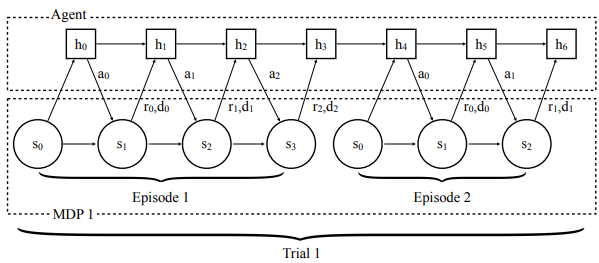
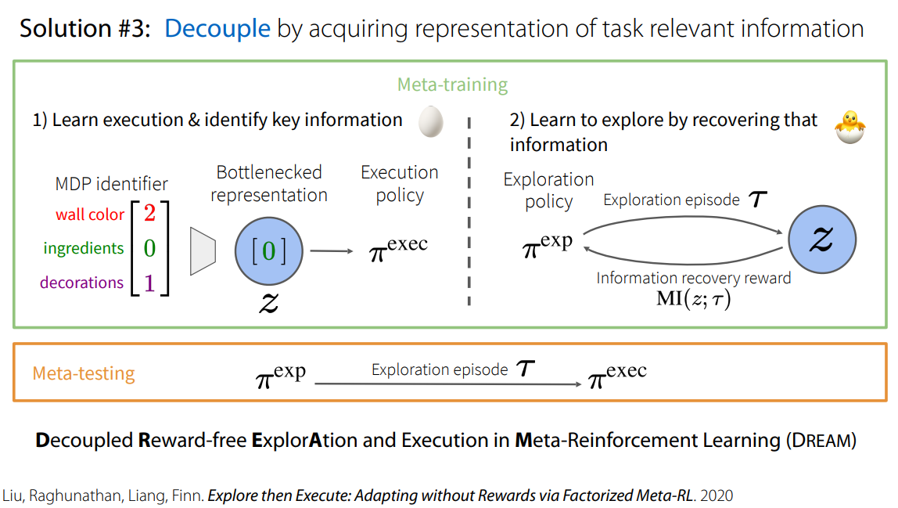
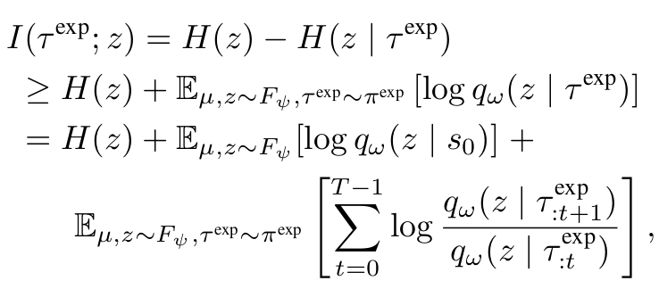

# Lecture 12. Meta-RL: Learning to explore

> organization: 가짜연구소 (Pseudo Lab)  
> Editor: [이홍규](https://github.com/howsmyanimeprofilepicture) 
> 강의 자료:  [CS330 2020 Fall](http://cs330.stanford.edu/fall2020/slides/cs330_metarl2_2020.pdf) 
> 강의 영상: [Youtube](https://www.youtube.com/watch?v=xS6T_76mRYk)  

저희가 원래 학습 자료로 보던 [CS330 강의 영상](https://www.youtube.com/playlist?list=PLoROMvodv4rOxuwpC_raecBCd5Jf54lEa)에는 Lecture 12가 누락되어 있습니다. 그래서 해당 강의와 유사한 영상을 대신 참고해서 작성했습니다. 

## 1. End-to-End optimization의 한계

[^1]

[^1]: [$\text{RL}^2$](https://arxiv.org/pdf/1611.02779.pdf)

* End-to-End optimization의 대표적인 예시는  RNN 기반의 policy를 사용하는 $\text{RL}^2$입니다.
* 여기서 exploration policy와 execution policy가 따로 구분되지 않으며, exploration episode에서 policy가 리턴하는 최종 hidden state가 — *위의 예시에선 $h_3$가 바로 그 최종 히든 스테이트가 될 것입니다.* — task에 대한 이해를 위한 정보로써 사용됩니다.
* 하지만 End-to-End optimization은 **chicken-and-egg problem** 혹은 **coupling problem**을 야기할 위험을 갖고 있습니다.
* exploration과 execution의 서로에게 의존적이기 때문입니다.
* 다시 말해 좋지 못한 exploration은 해당 task의 MDP에 대해 많은 정보를 제공하지 못할 것입니다. 이는 곧 나쁜 execution으로 이어집니다.
* 역으로 나쁜 execution의 경우, 어떤 exploration이 제공되어도 적은 리워드를 리턴할 것이기 때문에, exploration을 제대로 평가할 수 없게 됩니다. 

## 2. Latent Task Variable $\mathbf z$ and  Posterior Sampling

* 이에 대한 대안으로는 각 태스크에 대해 latent task variable $\mathbf z$를 임베딩하는 것이 있습니다. 

$$
p(\mathbf z): \text{prior}\\ 
\Large q_\phi(\mathbf z ~|~\underbrace{\text{Experiences}}_{ \{ (\mathbf{s_i,~s'_i},~a_i,~r_i) | i = 1,\cdots,K \}}) :\text{posterior}
$$

* 그리고 이에 대해 prior를 정의하고, $\phi$로 parameterized되는 posterior $q_\phi$를 구현함으로써, 다음과 같은 알고리즘을 구성하게 됩니다.

$$
\texttt{ 1. }& \mathcal T \sim p(\mathcal T)\\
\texttt{ 2. }& \texttt{env = makeEnv($\mathcal T$)}\\
\texttt{ 3. }& \texttt{experiences = set()} \\
\texttt{ 4. }& \texttt{for $\cdot$ in range($K$):} \\
\texttt{ 5. }& \qquad \mathbf z \sim q_\phi(\mathbf z|\texttt{experiences})\\
\texttt{ 6. }& \qquad a \sim \pi_\theta(a| \mathbf{s, z})\\
\texttt{ 7. }& \qquad \texttt{$\mathbf{r,~s'}$ = env.step($a$)}\\
\texttt{ 8. }& \qquad \texttt{experiences.add($(\mathbf{s,~s'},~a,~r)$)} 
$$

* Kate Rakelly et al (2019) - ["Efficient Off-Policy Meta-Reinforcement Learning via Probabilistic Context Variables"](https://arxiv.org/abs/1903.08254)

## 3. Exploration Policy와 Execution Policy 분리하기

* 또 다른 어프로치로는 exploration policy와 execution policy를 따로 분리해서 학습시키는 것입니다.
*  exploration policy $\pi_\phi^\text{exp}$의 경우, **mutual information** $I(\tau^\text{exp};~z)$ 을 maximize하는 방향으로 학습하게 됩니다.
* 먼저 pseudo-code를 통해 대략적인 알고리즘을 파악해보십니다.

$$
\begin{align}
\texttt{ 1: } & \mu \sim p(\mu)\\
\texttt{ 2: } & z \sim F_\psi(z|\mu) \\
\texttt{ 3: } & {\color{magenta}\texttt{// update expoloration policy}} \\
\texttt{ 4: } & \tau^\text{exp} \sim \pi_\phi^\text{exp}(a_t|s_t, \tau_{1:t}^\text{exp})  \\
\texttt{ 5: } & \text{Update $\pi_\phi^\text{exp}$ and $q_\omega$ to maximize $\underbrace{I(\tau^\text{exp}; z)}_{\text{the mutual information}}$} \\
\texttt{ 6: } & {\color{magenta}\texttt{// update execution policy}}\\
\texttt{ 7: } & z \sim q_\omega(z|\tau^\text{exp})\\
\texttt{ 8: } & \mathcal J = \mathbb E_{\mu\sim p(\mu),~~z\sim F_\psi(z|\mu)}\left[
V^{\pi_\theta^\text{task}}(z; \mu)\right]
- \lambda \underbrace{I(z;\mu)}_{\text{information bottleneck}}\\
\texttt{ 9: } & \text{Update $\pi_\theta^\text{task}$ and $F_\psi$ to maximize $\mathcal J$}\\
\texttt{10: } & \\
\texttt{11: } & \\
\texttt{12: } & \\
\end{align}
$$

$$
\Large
\mathcal J = \mathbb E_{\mu\sim p(\mu),~~z\sim F_\psi(z|\mu)}\left[
V^{\pi_\theta^\text{task}}(z; \mu)\right]
- \lambda \underbrace{I(z;\mu)}_{\text{information bottleneck}}\\
\large \text{where $V^{\pi_\theta^\text{task}}$ is the expected returns of $\pi_\theta^\text{task}$ }
$$

* mutual information $I(\tau^\text{exp};~z)$ 는 다음과 같이 정의됩니다.

* 위 수식에서 확인할 수 있듯, mutual information은 어떠한 lower bound를 갖게 되며, 우리는 해당 lower bound를 maximize하는 것으로 object를 수정할 수 있습니다.

## 4. Other solutions

* 강의에서 소개된 다른 솔루션들은 다음과 같습니다.

* Use intrinsic rewards - [MAME (Gurumurthy, Kumar, Sycara. CoRL ’19)](http://proceedings.mlr.press/v100/gurumurthy20a/gurumurthy20a.pdf)

* Task dynamic & reward prediction - [MetaCURE (Zhang, Wang, Hu, Chen, Fan, Zhang. ‘20)](https://arxiv.org/pdf/2006.08170.pdf)

## References

1. Chelsea Finn (2020). ["Learning Exploration Strategies with Meta-Reinforcement Learning"](https://www.youtube.com/watch?v=xS6T_76mRYk) (YouTube)
1. Chelsea Finn (2020). ["Learning Exploration Strategies with Meta-Reinforcement Learning"](https://simons.berkeley.edu/sites/default/files/docs/16342/chelseafinnrl20-1slides.pdf) (PDF)
1. Kate Rakelly, Aurick Zhou, Deirdre Quillen, Chelsea Finn, and Sergey Levine (2019). ["Efficient Off-Policy Meta-Reinforcement Learning via Probabilistic Context Variables"](https://arxiv.org/abs/1903.08254)
1. Evan Zheran Liu, Aditi Raghunathan, Percy Liang, and Chelsea Finn (2020). ["Decoupling Exploration and Exploitation for Meta-Reinforcement Learning without Sacrifices"](https://arxiv.org/abs/2008.02790)
1. Chelsea Finn (2021). ["Stanford CS330: Deep Multi-task & Meta Learning I 2021 I Lecture 12"](https://www.youtube.com/watch?v=_KoLFz5BTWw) (YouTube).

