# CS330 Lec9. Reinforcemeht Learning : A Primer, Multi-Task, Goal-Conditioned

>Organization: 가짜연구소 (Pseudo Lab)  
>Editor: [백승언 (Seungeon Baek)](https://github.com/SeungeonBaek)  
>강의 자료: [CS330 2020 Fall](materials/Lec9_material/cs330_rl_gc_mt_karol.pdf)  
>강의 영상: [Youtube](https://www.youtube.com/watch?v=WK9mi2ZDtg4&list=PLoROMvodv4rOxuwpC_raecBCd5Jf54lEa&index=8)  
> 강의 보조 자료: [HER](https://arxiv.org/abs/1707.01495)  
> 강의 보조 자료 리뷰: [HER 리뷰](https://ropiens.tistory.com/136)  

 안녕하세요, Nota AI에서 강화학습 연구원으로 재직중인 백승언 입니다. 5기에 이어, 6기 아카데믹 러너에 참여하여, 열정 있는 분들과 CS330 스터디를 이어갈 수 있어 너무 감사한 것 같습니다.

두 번 연속 스터디를 주최하고 이끌어가 주시는 민예린님과, 한 명의 이탈자도 없이 같이 참여해주시는 스터디원 분들 모두, 이 자리를 빌어, 다시 한 번 감사드립니다.
 
사다리 타기에 져서, 스터디의 시작이자 CS330의 RL 파트의 시작을 맡게 되어 어느정도 부담도 되지만, 열심히 강의를 리뷰 해보도록 하겠습니다!

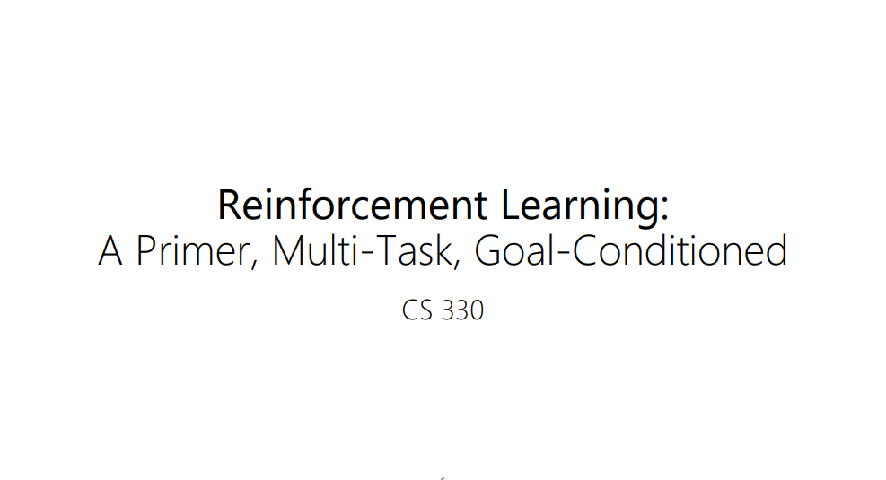

해당 강의의 RL 파트의 시작인 본 강의는 첼시 핀 교수 대신 카롤 교수가 강의를 이어가는 것 같습니다.

카롤 교수님께서 해당 강의는, 뒤이어 계속될 RL 강의의 Primer라고 얘기를 해주시고 계시며, 또한 Multi-Task RL, Goal-Conditioned RL에 대해서 다룬다고 합니다.

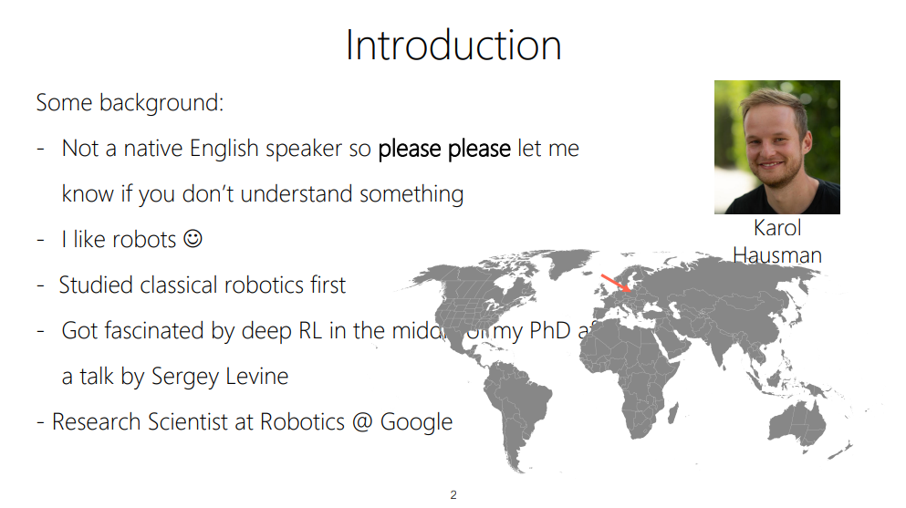

Karol Hausman 교수님은 폴란드 출신이라고 합니다. 고전적인 로보틱스를 공부한 배경을 가지고 계시며, 세르게이 레빈 교수님께 박사 학위를 받았다고 하네요 후후..

강의 기준으로, 2020년 에는 구글 브레인에서 로보틱스팀에서 Research Scientist포지션을 맡고 있다고 하시네요. (믿고 듣는 스탠포드 강의?)

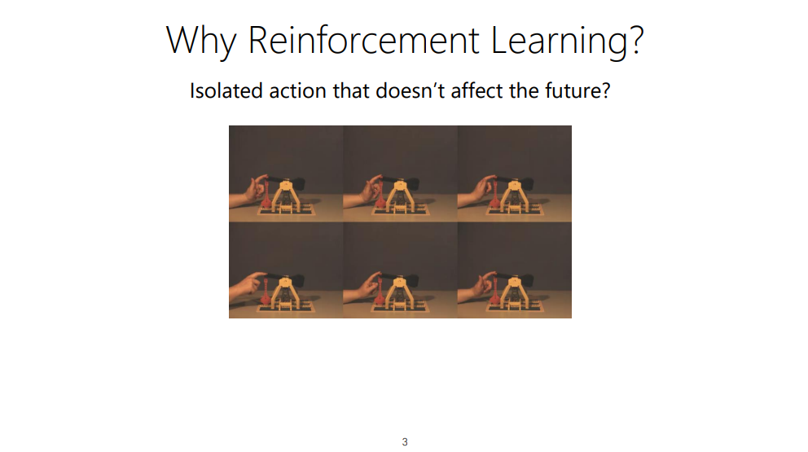

이 장에서는 왜 강화학습에 관심을 가져야 하는지에 대해서 얘기를 하는 것 같습니다.

먼저, 단일 행동이 미래에 영향을 끼칠까?에 대해서 얘기를 시작합니다.

카롤 교수는 그렇다고 합니다. 그러면서, 슬라이드에 표현된 더블 펜듈럼을 통해, 카오스 이론과 나비 효과에 대해서 설명을 해주고 있습니다.

강의에서는, 정말 작은 초기 값의 차이(손으로 미는 힘)에 따라서 궤적이 아예 달라진다고 하네요. (강의에서는 애니메이션입니다!)

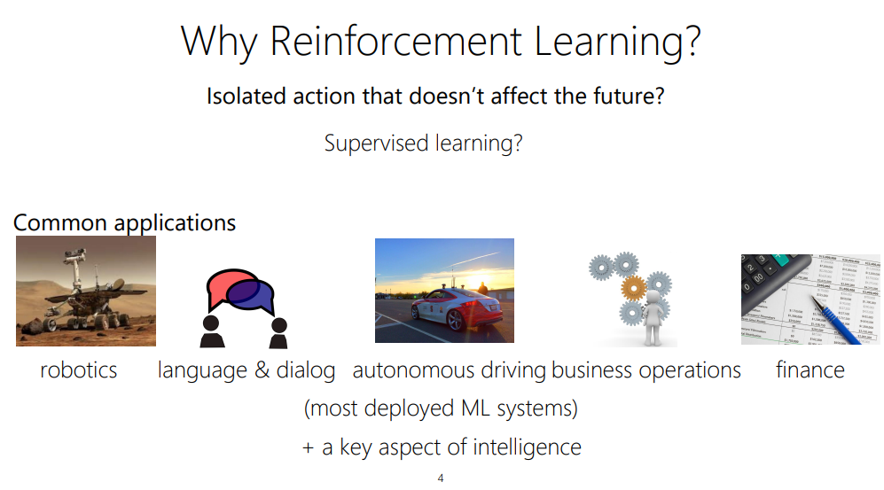

강화학습은 이런 문제들을 해결하는 것을 노력한다고 합니다.
* robotics: 연속적인 모터 제어
* language & dialog: 연속적인 대화..ㅎ
* autonomous driving: 연속적인 제어
* business operaetion: 연속적인 의사결정...?
* finance: 연속적인 구매/판매..?

그리고, 모든 행동들이 실제로 long term 결과를 가져온다고 생각하고, 모델링을 하려고 한다고 합니다.

그래서, 순차적 의사 결정 문제를 풀기에 좋은데, 어떤 행동이 미래에 어떻게 영향을 주는지, 미래 결정에 어떤 영향을 주는지 등등을 해결할 수 있다고 합니다.

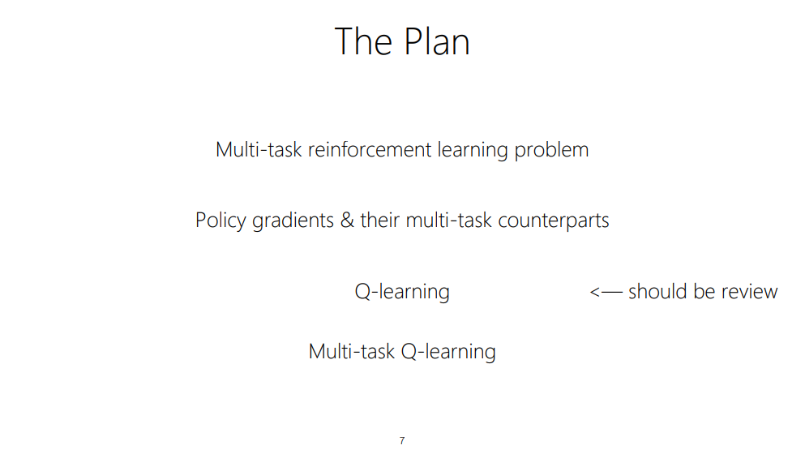

해당 강의의 첫 번째 목적은, muilti-task RL과 친해지는 것이라고 합니다.
* 그 후, Policy gradient method와, multi-task RL 문제를 Policy gradient를 이용해서 해결하는 방법에 대해 다룬다고 합니다.
* 그 다음, Q learning과, multi-task RL 문제를 Q learning을 이용해서 해결하는 방법에 대해서 다룬다고 합니다. 

그럼 먼저, multi-task RL에 대해서 다뤄 보겠습니다!

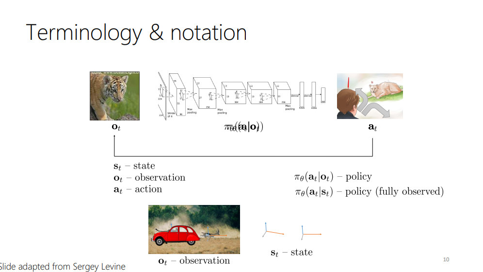

이 장에서는, 본격적인 강의 이전에, 해당 강의에서 사용할 용어들에 대해서 먼저 짚고 넘어가려고 하는 것 같습니다.
* 카롤 교수님은 용어를 설명하기 위한 예시로써, 지도학습 파이프라인 내에서, image에서의 객체 인식을 사용했습니다. (슬라이드엔 없고 상기 링크가 준비된 영상에서, 애니메이션 이전의 그림을 볼 수 있습니다.)
  - 해당 지도학습 파이프라인 하에서, image가 입력되면, image가 신경망을 통과하고, 신경망은 image의 class를 출력합니다.
  
* 이를 강화학습으로 바꿔 보면... 일단, 모든 입력과 출력에 time step t가 sub index로 붙는다고 합니다.
  - 입력의 경우, 특정 time step t에 입력받은 image (o_t)가 되며, 신경망은 해당 time step에 대해서 action(a_t)을 출력 한다고 합니다.
  - 또한, action은 다음 observation (o_(t+1))에 영향을 줄 것이라고 합니다. 그러면 다음 스텝의 액션(a_(t+1))이 출력 되고.. 샬라 샬라
    + 그림에서는 유쾌하게도, 도망갈 방향을 선택하는 것을 action으로 사용한 것 같습니다.

위의 과정을 간단히 표기하기 위해, 다음과 같은 표기법(notation)을 사용한다고 합니다.

 o_t - observation at time step t  
 a_t - action at the time step t  
 \pi_\theta(a_t|o_t) - probability of action a_t given o_t  
 \pi_\theta(a_t|s_t) - probability of action a_t given s_t  
 
이때, s_t에 대한 정책은, fully observable한 상황에서만 얻을 수 있다는 언급을 하고, 다음 장에서 이를 설명하고자 하였습니다.

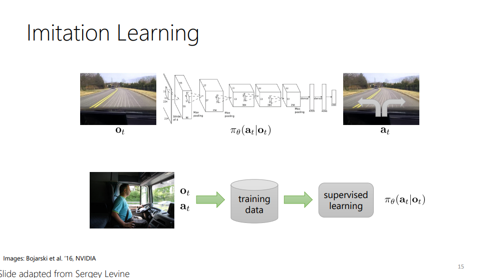

위에서 state와 observation의 차이를 설명하기 위해, 철학에서 다음과 같은 예시를 빌려왔다고 합니다. 똑똑하신 분.. 이는 플라토의 동굴이라고 하네요.

state는 어떻게 행동해야 할 지를 알기 위해 필요한 정보이며, observation은 right decision을 내리기에는 불완전한 정보라고 합니다. 

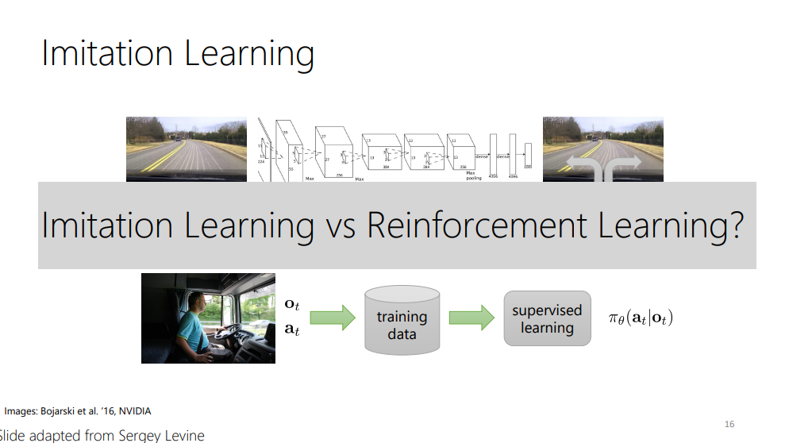

이전의 호랑이 그림에서, 정확한 액션을 하기 위해서는, image안에 무엇이 있는지를 먼저 알아야 한다고 합니다. 물체의 위치, 속도 등 state들은 이를 모두 포함한 것이며, observation은 occlusion을 포함할 수 있다고 합니다.

그러면, 모든 것을 observe하지 못 할때 어떻게 해야 할까?는 나중에 다룬다고 하네요! (애니메이션에서 생략된 page)

또한, 어떻게 정책을 찾는 지에 대해서 설명을 해 주고 있는데, 지도학습을 통해, 지식을 획득하여 정책을 얻는 방법이 있다고 합니다. 이를 이미테이션 러닝이라고 한다고 합니다.
* 카롤 교수님은, 운전을 예시로, 운전 data set을 마구 모아 training data set을 구축하고, 이를 통해 image에 따른 action을 하는 것을 얘기해 주었습니다.

이런 Imitation learning에서의 문제는 compounding error라고 하는, error가 점진적으로 accumulate되어 결국에 본 적 없던 state를 만나 잘못된 액션을 취하는 문제를 야기한다고 합니다.

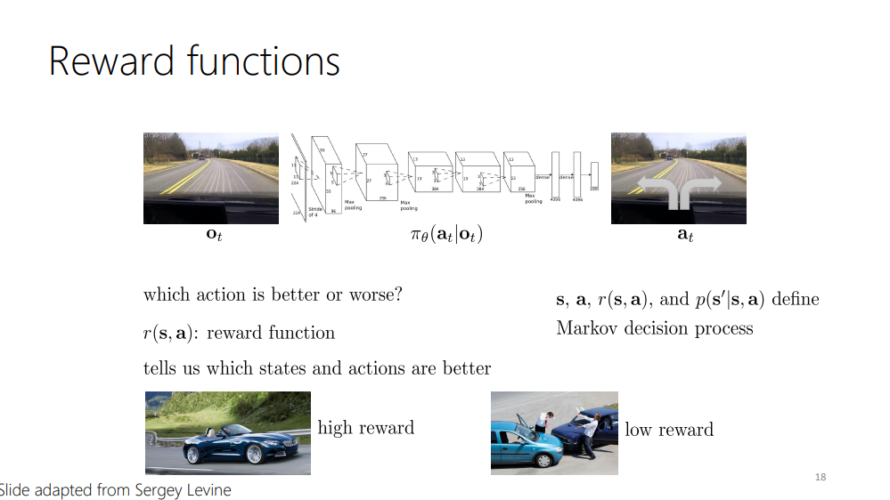

강화학습은, 이러한 정책을 찾는 과정을 조금 더 전반적인 과정을 통해서 모델링 한다고 합니다.

강화학습에서는 optimize해야 할 utility가 있어야 한다고 합니다.

정책을 앞서 언급한 것 처럼 모방학습 처럼 인간 처럼 행동할수록 최적화 할 수도 있지만, 강화학습에서는 리워드를 최적화 한다고 합니다.

리워드는 어떤 액션이 좋은지 혹은 나쁜지에 대한 것을 알려줄 수 있는 함수라고 합니다.

이 함수는 state와 action에 의존 적이라고 하며, scalar value를 가지고 있다고 합니다.

운전을 예로 들면, high reward는 안전한 운전을 하였을 때 피드백 받을 수 있는 값이며, low reward는 사고 등 안좋은 운전을 하였을 때 피드백 받는 값이이라고, 예시로 들어 설명하고 있습니다.

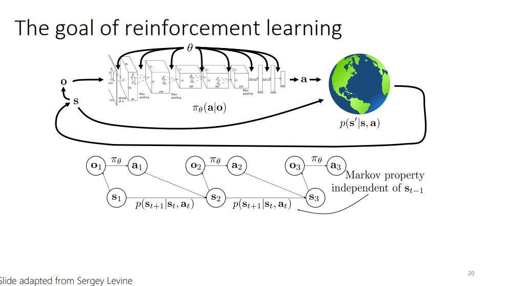

이 장 부터는 RL의 goal과 framework에 대해서 다룬다고 합니다.

목표는 policy의 parameter theta를 찾는 것이라고 합니다.

policy는 observation를 입력 받고, action을 출력하는 것이라고 합니다.
또한, world는 state와 action을 입력 받아 next state를 생산한다고 합니다.

또한, 이 장에서 강화학습에서 다루는 state는 이전의 state에만 관계가 있다고 하는, Markov property에 대해서도 설명을 합니다.

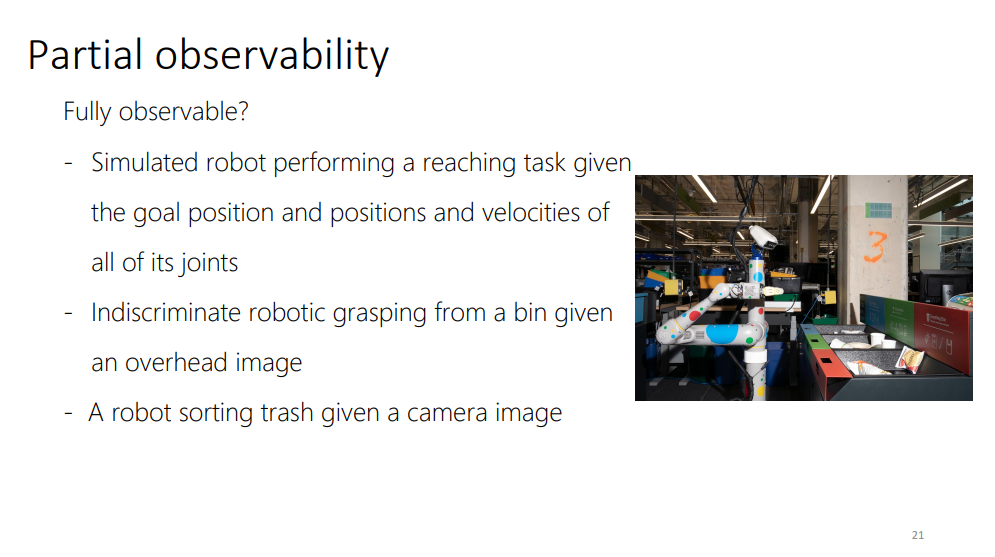

이 장에서는, 부분적으로 관측 가능한 시스템과 전체적으로 관측 가능한 시스템을 설명합니다. 슬라이드에는 안 나오지만, 여러 환경들이 fully observable한지, partial observable한지 학생들에게 질의 응답을 하며 인사이트를 나눠주었습니다.

ex) 카메라를 사용해서 image를 보고 물건을 잡는 task는 partial observable
* 왜냐하면, 물체의 무게도 모르고, z축 길이도 모를거고 등등...

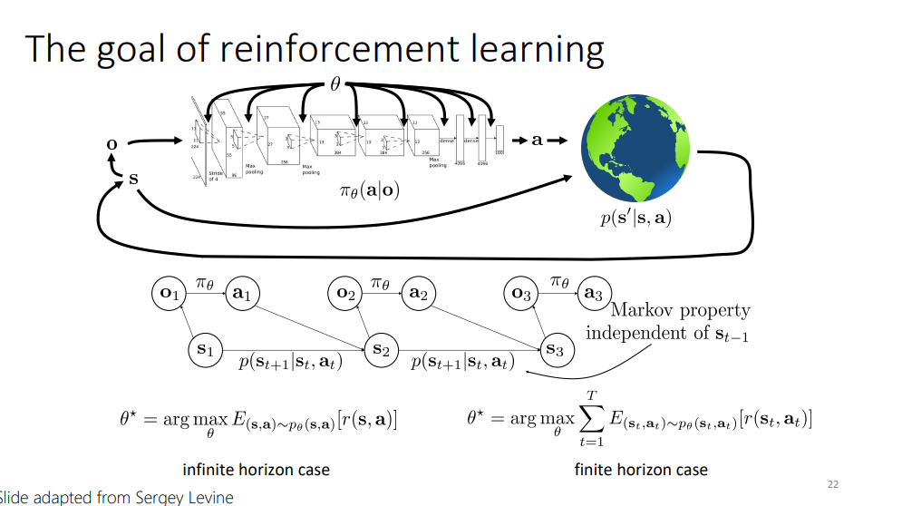

다시 한 번 강화학습의 목표 slide로 돌아와서, RL의 목표는 stationary한 환경에서(특정 state에서 action을 주면 무조건 특정 state'으로 변화), infinite horizon case(인생과 같이 끝나지 않는 의사 결정..)에서 reward의 기댓값을 최대로 하는 policy의 parameter들을 찾는것이라고 합니다.

finite horizon case(time 1~T)에서는 reward들을 1부터 T까지 sum up하는 기댓값을 최대로 하는 policy의 parameter들을 찾는 것이 목표라고 합니다.

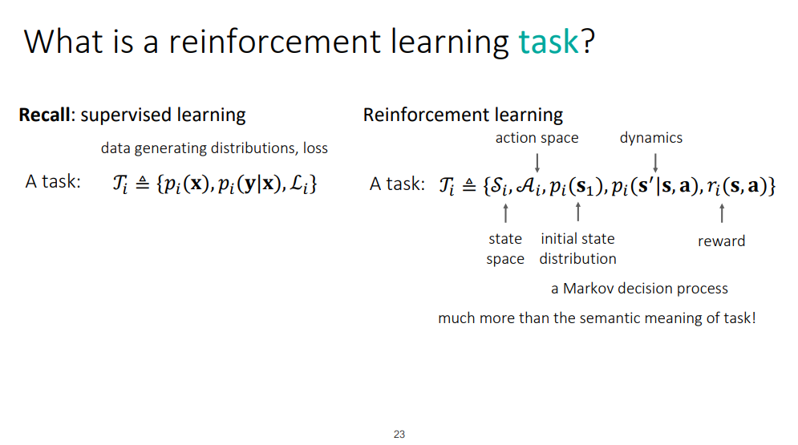

이 장에서는, 강화학습에서, task가 무엇인지에 대해서 이 장에서부터 언급이 되려고 하는 것 같습니다.

카롤 교수는 지도학습에서의 task는 x와 y의 data 분포, loss들을 묶어 task라고 했던 것을 다시 한 번 상기 시켜 줍니다.

이때, 강화학습에서의 task는 조금의 항들이 더욱 붙는다고 합니다. state space S, action space A, initial state distribution p(s_1), transition function p(s'|s,a), reward function r(s,a).

이는 사실 MDP이며, task의 의미론적 의미? 보다 많은 것을 담고 있다고 합니다.
이 말은 => 같은 task처럼 보여도, 강화학습 안에서는, 다른 MDP를 가지고 있다면 다른 task라고 하네요 오....

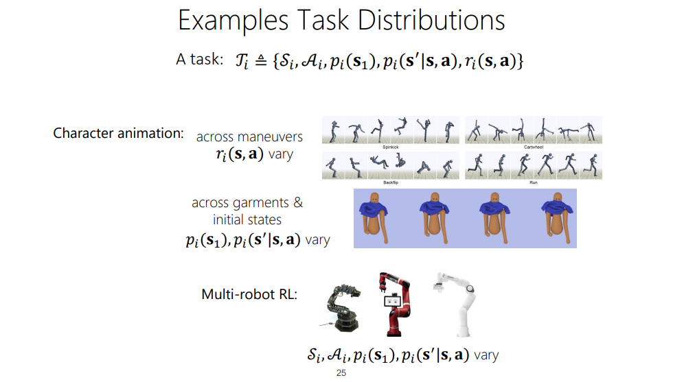

이 장에서는, task distribution들의 예시에 대해서 설명을 하고 있습니다.

예를 들어, 첫 번째 사진 속 캐릭터 애니메이션에서는, 다른 동작들을 학습하기 위한 다른 태스크들을 얘기할 수 있다고 합니다. 이 경우에는, task들 끼리 reward function이 다르다고 합니다.

두 번째 사진 속 캐릭터 에니메이션에서는, 옷들이 다르고, 옷들이 입혀져 있는 상태가 다르므로, initial state distribution p(s_1)과 p(s'|,s,a)가 다르다고 합니다.

세 번째로는, 3개의 다른 로봇들에서의 강화학습을 예로 들고 있습니다. 해당 예제에서는 동일한 reward 즉, 물체를 잡았을때 발생하는 reward만 동일한 채, 나머지 MDP의 모든 요소가 다른 task라고 하는 것 같습니다.

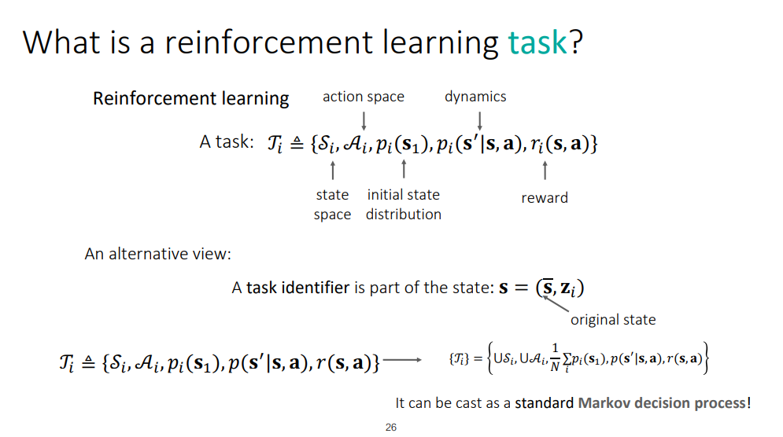

이 장에서는, 다른 관점에서 RL에서의 task를 설명하고자 하는 것 같습니다.

만약 state를 s=(\bar s, z_i)로 확장하고, task identifier z_i를 state에 붙인다면, multi-task setup을 single task와 같이 할 수 있다고 합니다! (맨 마지막 식)

이렇게 하면, multi-task RL problem을 one Markov Decision Process로 표현 할 수 있다고 합니다.

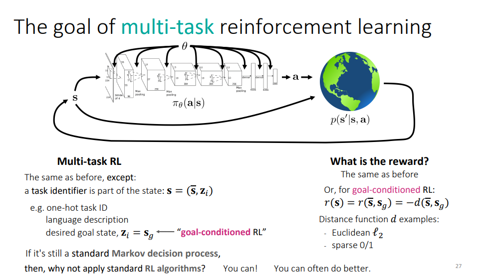

Multi-task RL에서의 목표는 이전에 본 것과 동일하다고 합니다. task identifier를 제외하고!

이러한 task identifier는 여러 종류가 될 수 있다고 합니다.
* one-hot task ID
* language description
* desired goal state

또한, desired goal state z_i=s_g는 goal-conditioned RL에서 다룰 예정이라고 합니다.
* goal-conditioned RL에서, reward는 보통 state와 goal state사이의 거리의 음수 값으로 정의 되며, 거리 함수는 여러 형태가 될 수 있다고 합니다.
  - 유클리드 거리
  - sparse 0/1

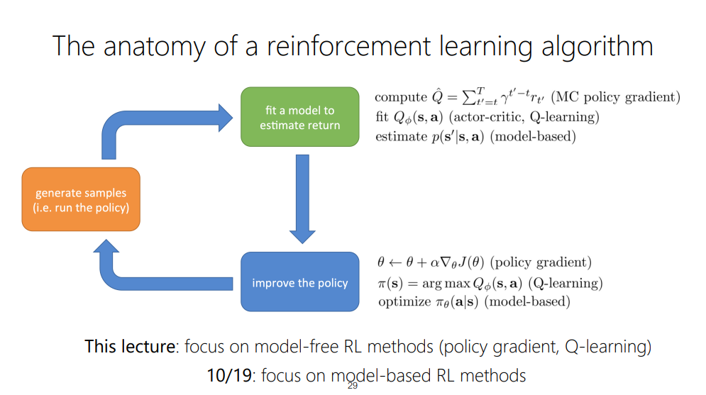

이 장 부터는 여러 RL algorithm을 해부하는 시간을 가지겠다고 합니다 꿀꺽..

강화학습 알고리즘은 일반적으로
1. sample을 생성하는 단계,
2. model이 return을 fit하는 단계,
3. policy를 improve하는 단계로 나뉜다고 합니다.

2에서,
모델이 return을 fit하는 단계에서, 현재 rollout의 모든 reward를 합치고, 이를 이용해 policy gradient를 수행하는 알고리즘이 MC policy gradient라고 합니다.

Actor-critic, Q-learning method들은 Q-funcdtion을 통해 return을 fit하고자 한다고 합니다.

model-based methods들은 transition function을 fit해서 return을 계산하는 방식을 이용한다고 하는 것 같습니다.

3에서,
policy gradient method는 policy의 gradient를 직접적으로 구해서, 모델의 parameter에 적용하는 방식을 사용한다고 하는 것 같습니다.

Q-learning method는 Q-function들을 최대화 하는 방향으로 학습이 진행되며, 이를 통해 정책을 선택한다고 합니다. argmaxQ(s,a)!

model based methods에서는 model(p)을 학습하고, 이를 이용해서 policy를 직접적으로 최적화 한다고 합니다.

이 강의 내에서는 PG methods와 Q learning methods를 다룬다고 합니다!
model-based는 다른 강의에서 다룬다고 하네요!

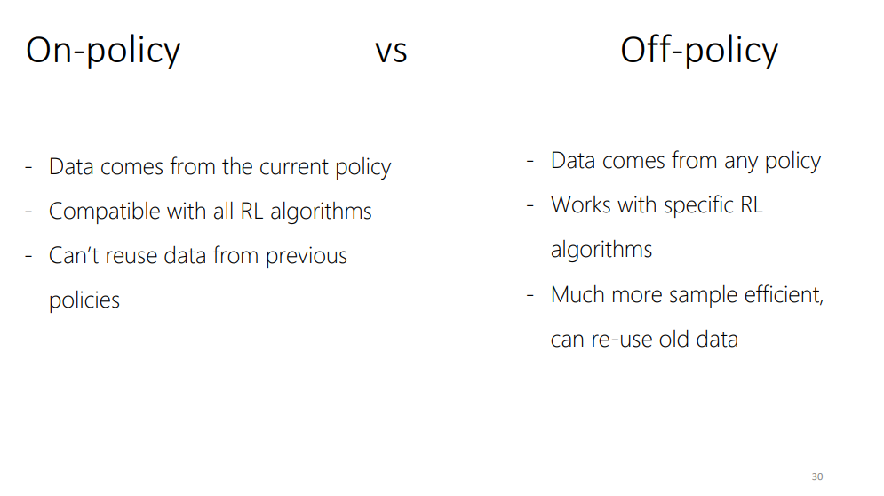

이 장에서는 On-policy RL, Off-policy RL에 대해 다룬다고 합니다.

on-policy RL에서는, 현재 policy로부터 얻어진 data distribution을 이용해서 정책을 학습시키는 알고리즘을 말하며, off-policy는 다른 policy로부터 얻어진 data distribution을 이용해서도 정책을 학습 시킬 수 있는 알고리즘을 말하는 것 같습니다.

장점과 단점은 슬라이드에 잘 나와 있으며, 그 자체의 특성으로 부터 기인한 것이 많은 것 같습니다.

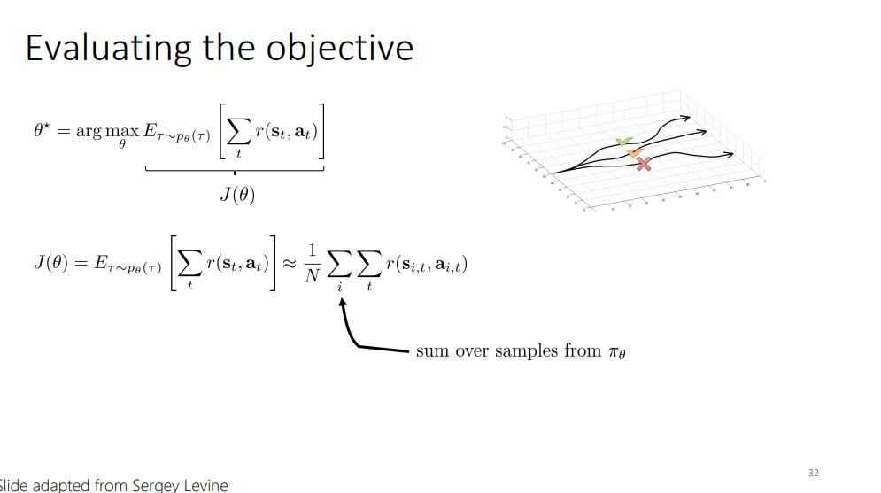

이 장 부터는 policy gradient에 대해서 다룬다고 합니다. 또한 PG를 설명할 때는 on-policy 기조를 유지한다고 합니다.

이 장에서 익숙하지 않은 term인 \tau는 state와 action의 joint probability로부터 나온 궤적이며, 오른쪽 그림의 initial state로부터 쫙 뻗어나가는 궤적을 생각해 주시면 될 것 같습니다.

그래서, 해당 parameter theta하에서의 얻어진 trajectory들 이내의 sum of rewards들의 기댓값을 최대로 하는 것이 목적 함수이며, 이를 만족하는 theta*를 찾는 것이 목표라고 합니다.

argmax 안쪽 term을 J(theta)로 표현하게 되면, 해당 J(theta)는 sampling을 통해 얻을 수 있다는 얘기를 카롤 교수는 전달합니다. 오른쪽 위 그림의 궤적 3개의 샘플!

그러면, 카롤 교수는 어떻게 정책을 평가하는지는 보았으니, 이를 어떻게 개선 시킬 수 있을 지에 대해서 이 장에서 설명한다고 합니다. 어떻게 직접적으로 이를 미분할 지..!

그 방법을 위한 첫 번째 단계는, J(theta)를 바로 theta에 대해 미분하는 것입니다. 

또한, log의 성질인 곱 => 합을 이용하기 위해, 이 단계에서는 3번 째 수식의 nabla_theta(pi_theta(tau))의 양변에 pi_theta(tau)/pi_theta(tau)를 곱해서, pi_theta(tau) * nabla_theta(*log(pi_theta(tau)))를 만들어 냅니다.

그 이유는 다음 장에..!

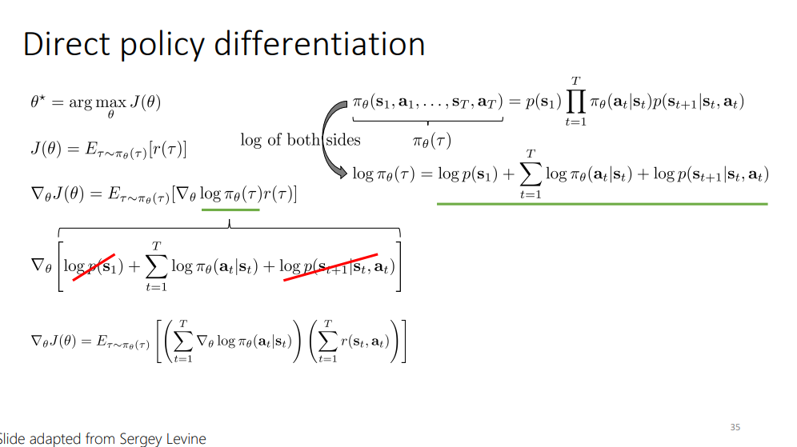

이렇게 nabla_theta(log(pi_theta(tau)))를 얻은 이후, pi_theta(tau)를 위 오른쪽 첫 번째 식처럼 분해를 하게 되면, 오른쪽 두 번째 식을 얻어낼 수 있습니다.

이때, theta에 대한 gradient는 두 번째 term만이 존재하기 때문에, 본 식은 왼쪽 맨 마지막 식만 남게 됩니다. 해당 gradient가 바로, policy를 개선할 수 있는 gradient인 것이라고 합니다.

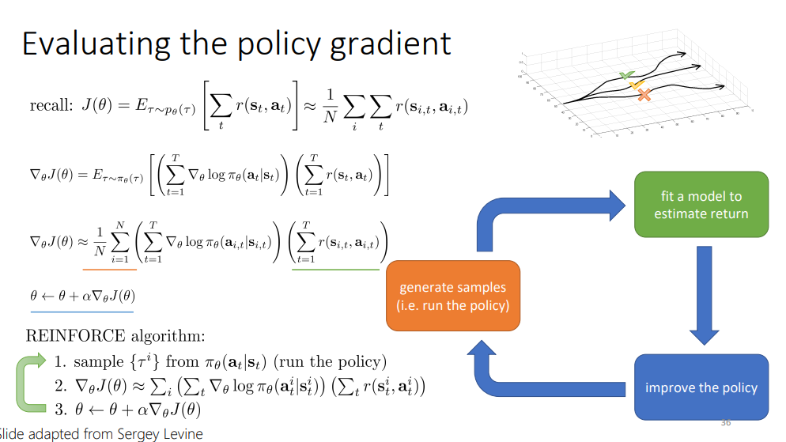

카롤 교수는 이때 질문을 합니다. 그러면, 이 문제를 어떻게 풀 수 있게끔 만들까? 이는 어떻게 policy evaluation => gradient를 쉽게 계산할 수 있을까로 이어진다고 합니다.

이는 전전전장에서 설명한 것 처럼, trajectory들을 sampling해서 수행할 수 있다고 합니다. 또한, N개의 표본에 대해 기댓값을 직접 계산해서 어느정도 근사 기울기 값을 구하는 방식으로 실제 학습을 수행할 수 있다고 합니다.

이렇게 얻은 gradient를 ascent하는 방향으로 theta를 업데이트 하기만 하면 끝!

다시 한 번, 3단계의 diagram을 가져와서, 해당 policy gradient를 이용해 theta를 업데이트 시키는 REINFORCE algorithm을 설명합니다.

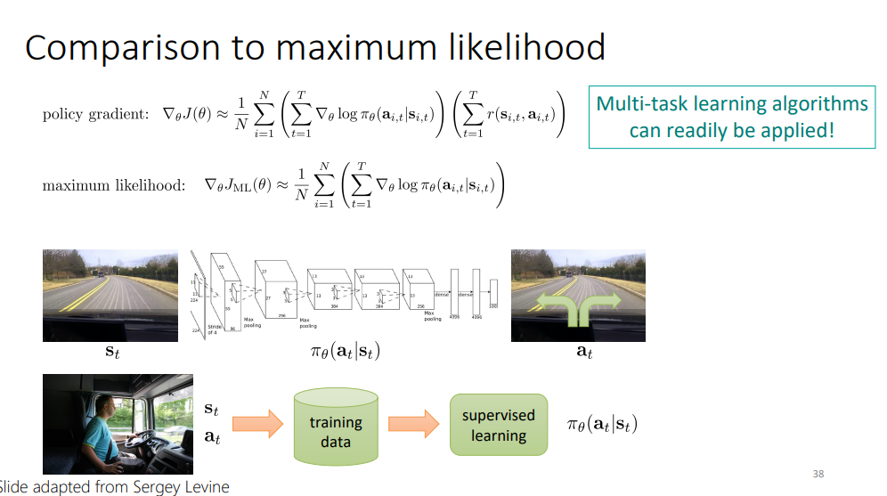

이 장에서는 재미있는 사실에 대해서 카롤 교수님이 공유를 하고 싶었던 것 같습니다.

이는 policy gradient의 식이 imitation learning에서 사용할 maximum likelihood와 유사하다는 것입니다.
* 실제로 식을 보게 되면, t=1~T까지의 reward의 총합 즉 return term의 유무만이 차이임을 알 수 있습니다.
* 그리하여, reward의 sum이 1이 되는 셋팅일 경우, imitation learning과 objective function이 정확히 같다는 것을 언급합니다.
  - 그러면서, 이에 대한 물리적 의미? 를 current rollout에서 current policy가 항상 positive한 업데이트만 된다! 라는 얘기를 해 주었는데, 살짝 모호한 감이 있는 것 같습니다.
* 또한, policy gradient에서 사용하는 objective function이 supervised learning에서 사용하는 그것과 비슷하다는 점은, 지도학습에서의 multi-task learning을 위한 개념들의 이식이 어렵지 않다는 뉘앙스의 이야기를 해 주셨습니다. 

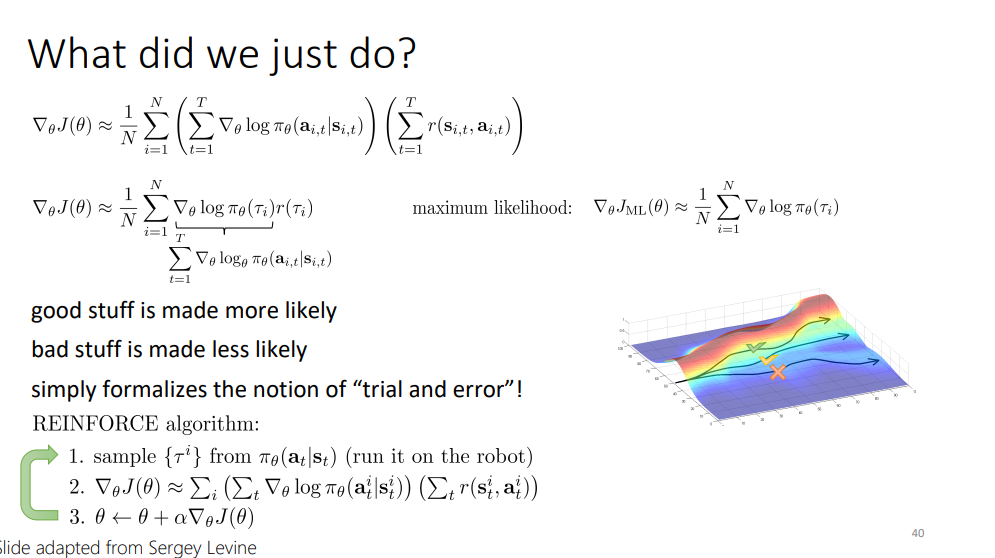

이 장에서 카롤 교수님은 짧게나마 각 과정에 대해 복습을 하는 시간을 가졌으며, 
maximum likelihood와 policy gradient의 objective function의 형태가 비슷하기에, reward의 총 합이 높을 경우, 해당 action | state의 likelihood 값이 높아지도록 학습이 잘 되며, 총 합이 낮거나 0일 경우, 해당 action | state의 likelihood 값이 낮아지도록 학습 되는 것이라는 인사이트를 전달해 주셨습니다. 

좋은 것은 더 좋게! 나쁜 것은 더 나쁘게!

trial - and - error를 통해 알아내자!

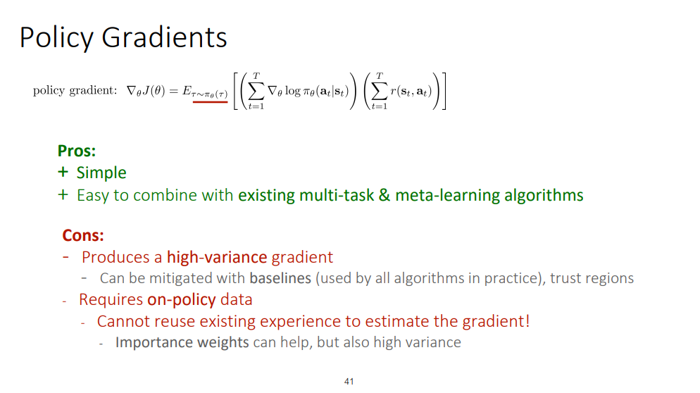

해당 장에서는 policy gradient에 대해서 요약해준다고 합니다.

장점
* 단순하다
* 기존에 존재하는 muiti-task & meta-learning algorithm들과 결합이 쉽다

단점
* high-variance gradient를 산출한다.
  - reward의 총 합이 sample to sample이 아닌 trajectory to trajectory로 차이가 나기 때문으로 설명하는 것 같습니다.
  - 이를 해결하기 위해, return에서 baseline을 빼는 일반적인 방법과, reward의 크기를 작게 만드는 방법 등이 있을것 같다고 얘기합니다. 언급하지는 않으셨지만, TRPO, PPO등 trust region내에서 업데이트를 하거나, 이전 정책과의 차이를 통해 penalty를 주는 알고리즘들도 슬라이드엔 표기가 되어 있는 것 같습니다.
* on-policy dasta를 요구한다
  - 이는 gradient를 추정하기 위해, 기존의 experience를 재 사용하지 못 하는 것을 의미한다고 합니다.
  - Important sampling이 이를 일부 해결해 줄 수는 있지만, 이 역시 high variance가 발생할 수 있다고 합니다.

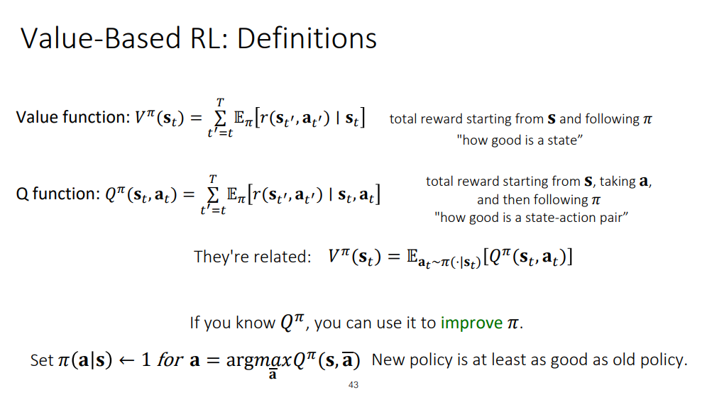

이 장 부터 카롤 교수님께서는 Value-based RL에 대해서 다루려는 것 같습니다.

Q-learning은 off-policy algorithm이라고 하며, 그렇기에, data를 많은 다른 정책들로부터 얻어낼 수 있다고 합니다.

본격적인 설명 이전에, 카롤 교수님은 몇몇 용어들에 대한 정의로 시작을 하시는 것 같습니다.

Value function V^\pi(s_t)는 정책 pi 하에서, 현재 state로부터 시작해서 얻은 reward들의 총합을 표현하는 함수라고 합니다.
* 이는 현재 policy 하에서 특정 state의 가치를 표현한다고 합니다.

Q function Q^\pi(s_t, a_t)는 정책 pi 하에서, 현재 state에서 action으로 행동을 했을때 부터 얻은 reward들의 총합을 표현하는 함수라고 합니다.
* 이는 현재 policy 하에서, 특정 state에서 특정 action을 선택하는 것의 가치를 표현한다고 합니다.

또한, 그 둘은 3번째 식의 형태로 관계가 있다고 합니다. 즉 특정 상태 s_t에서 모든 행동에 대한 Q function의 기댓 값이 Value function이라는 것 같습니다.

Q 값을 이용하는 policy의 경우, Q를 가장 크게하는 action을 고를 확률이 1이 되게끔 하는 것 같습니다.

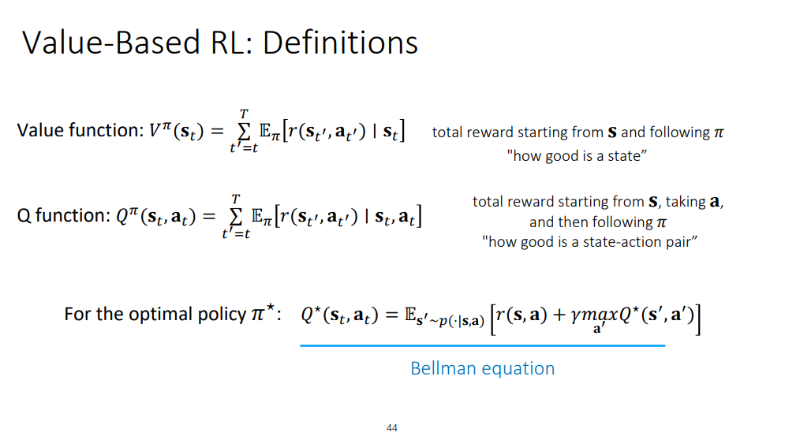

이 장에서는, 또 하나의 중요한 방정식에 대해서 설명한다고 합니다.

그 전에 앞서 pi^star는 optimal policy, Q*는 optimal policy  pi^star하에서의 Q function 값이라고 하는 것 같습니다.

이러한 optimal policy pi* 하에서는 3 번째 수식인 Bellmal optimality equation이 성립한다고 하며, Q-learning을 수행함에 있어서 이 수식을 이용하게 될 것이라고 합니다.

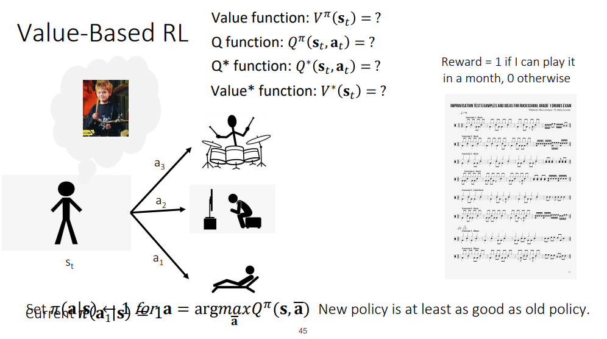

이 장에서는, bellman optimality equation의 concept을 이해하기 위해 카롤 교수님이 그린 그림들이 준비 되어 있습니다ㅎ

그림 속 졸라맨은 악보를 잘 연주해야 하며, 1달 안에 연주를 하면 reward 1, 아니면 0을 받는다고 합니다.

이때, 졸라맨의 action1은 휴식, action2는 드럼 비디오 시청, action3은 실제 드럼 연습이라고 합니다.

현재 policy가 pi(a_1|s) = 1 즉, 휴식을 선택하는 것이라고 할 때, V^pi(s_t)는?!
0이라고 합니다ㅎ
action이 a_1일 때, Q^pi(s_t,a_t)는?! 넵 ㅎ 0이라고 합니다. a_2도 0은 아니지만 낮은 값이고.. 하지만 a_3일때는 1근처라고 합니다! 재미있는 예시네용

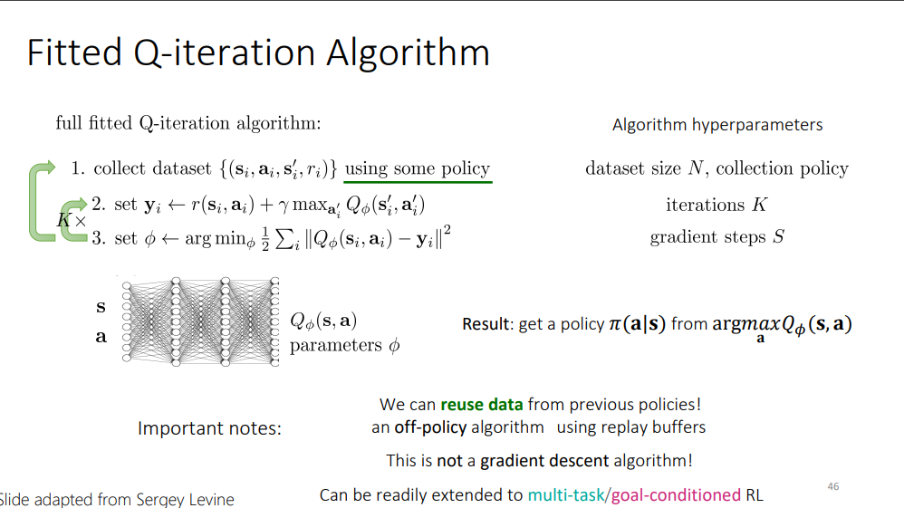

이 장 부터는 practical한 Q-learning algorithm 에 대해서 알아보겠다고 하십니다.

카롤 교수님이 설명하실 알고리즘은 Fitted Q-iteration Algorithm이라고 합니다.
해당 알고리즘은...
1. 먼저 몇몇 정책을 이용해 dataset을 획득 (N size)
2. y = r(s, a) + gamma max_a Q(s',a')의 target 값을 계산
3. phi로 모수화된 Q(s,a)와 y의 차이를 최소화 시킬 수 있는 phi를 계산
(2~3을 K 번 반복, S만큼의 gradient step을 반복)

하는 과정으로 학습이 진행된다고 합니다.

또한, multiple action을 다룸에 있어서, 해당 알고리즘은 multiple head구조를 지닌다고 합니다. (여러 아웃풋)

그리하여, 결과로써 Q값을 최대화 하는 action을 고르는 greedy policy를 얻을 수 있다고 합니다.

또한, 해당 알고리즘은 previous policy들로부터 sample을 reuse할 수 있다고 합니다. (off-policy algorithm)
* 이때, sample을 관리하기 위해, 일반적으로 replay buffer를 사용한다고 합니다.

해당 알고리즘은 policy gradient와 따르게 gradient descent algorithm이 아니라고 하며(pi 입장), multi-task RL과 goal conditioned RL로의 이식이 쉬운 알고리즘이라고 합니다!

하지만 meta-learning으로의 확장은 어렵다고 하며, 뒤이어 설명한다고 하시네요!

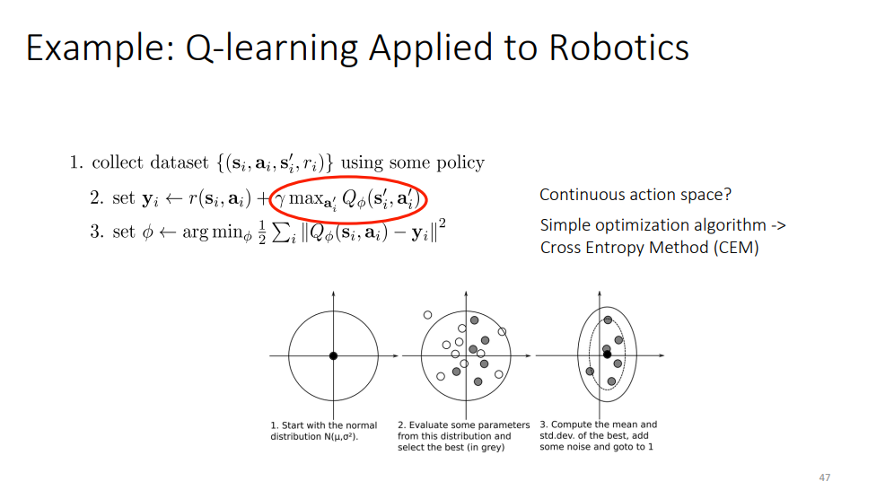

이 장에서는, 이전 연구이긴 하지만, Google에서 로봇을 이용해 했던 연구를 공유해 주셨습니다.

또한, Q-learning을 이용해 continuous action space를 커버하기 위해, CEM이라고 하는, cross entropy method 알고리즘을 사용했다는 내용을 공유해 주셨습니다.
* 이는 sampling 기반 최적화 알고리즘의 일종으로 보이며, 그림과 같이 1번 그림의 특정 표준 편차 내 표본을 샘플링 -> 평가 후 새로운 분포를 생성 -> 반복 의 과정을 통해 적절한 action을 선택하고자 하는 방법인 것 같습니다.
* 나머지는 Q-learning과 유사한 것 같습니다!

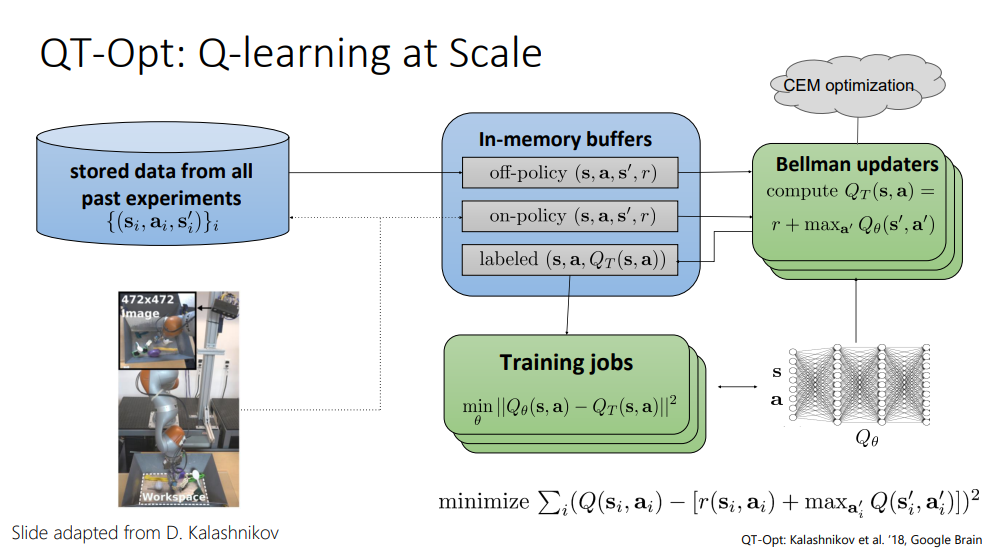

이 장에서는 Q-learning의 응용 버전인 QT-Opt에 대해서 설명해 주셨습니다.

이 또한 google에서 한 연구라고 하시네요ㅎ 로봇의 grasping task를 학습하기 위해 사용된 알고리즘이라고 합니다.

이 연구는 과거의 실험을 통해 얻어진 데이터들과 함께, on policy로 얻어진 data를 하나의 buffer에 저장하여 off-policy algorithm인 Q-learning의 장점을 십분 사용하고자 했던 알고리즘 같습니다.

DeepMind에서 유사하게 과거 Atari 게임 시연 데이터를 buffer에 넣은 Deep Q-learning form Demonstration을 봤던 기억이 나네요!

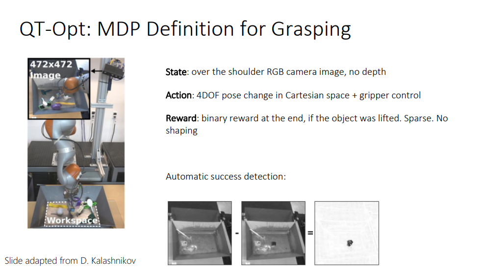

이 장에서는, 해당 QT-Opt를 통해 해결하고자 했던, Grasping task의 MDP formulation을 어떻게 했는지에 대해서 설명해 주고 계십니다.

State: RGB camera로부터 얻어진 2D image(partial observability)

Action: 4 자유도 pose 변화량 + gripper control 시그널

Reward: binary reward 0/1 (Sparse, No shaping setting)

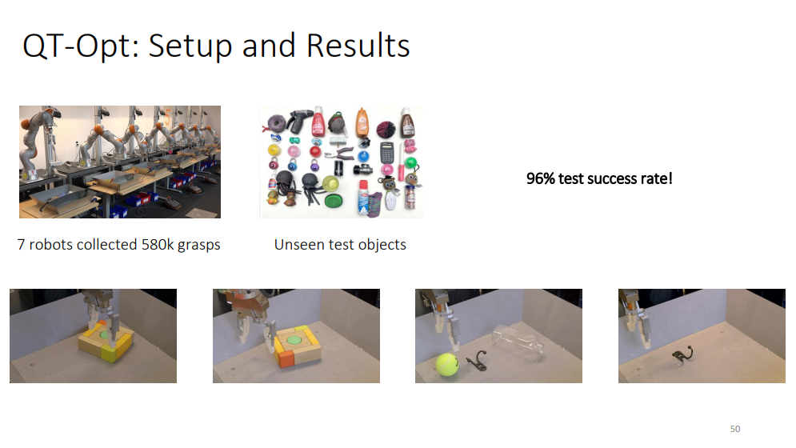

그에 대한 결과는 다음과 같다고 합니다.

총 7개의 로봇이 엄청나게 많은 데이터들을 몇 달 동안 수집하는 과정을 통했다고 하며, 그 결과, 학습에서 사용하지 않은 unseen object들도 96%의 성공률로 잡아냈다고 합니다. 몇 달이라... 한 번 실수하면 엄청 혼나겠군요

강의에서는 3번 째 사진의 small ball을 잡는 과정에서 사람이 툭 볼을 치는데, 그래도 다시 잘 잡았다고 합니다ㅎ

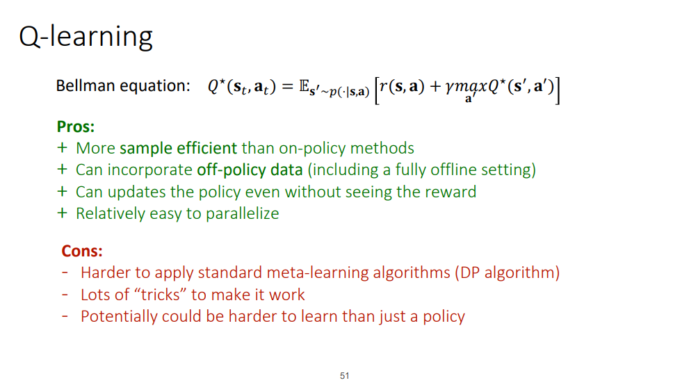

이 장에서는, Q-learning을 요약해 주셨습니다!

장점
* on-policy methods들에 비하여 더욱 sample 효율적이다.
* fully offline setting에서 수집된 데이터를 포함하여, 모든 off-policy data를 통합하여 학습에 사용 가능
* reward signal이 없더라도, policy을 업데이트 하는 것이 가능!
  - policy gradient에서는 reward signal이 없으면 gradient 자체가 발생하지 않으므로 불 가능 했던 점이라고 합니다.
* 병렬화가 on-policy methods들에 비해 용이하다고 합니다. 즉 여러 환경을 쉽게 사용 가능하다고 하는 것 같습니다.

단점
* standard meta-learning algorithm을 적용하는 것이 어렵다고 합니다.
  - 왜냐하면, gradient 기반이 아닌, DP algorithm 기반의 loss function을 통해서 학습이 되기 때문이라고 합니다.
* 학습을 "안정적으로" 하게 하기 위해서 많은 여러 "트릭"들이 필요하다고 합니다.
* Q function을 학습하는 것은 단지 정책을 학습하는 것에 비해, 잠재적으로 조금 더 어려움이 존재한다고 합니다.

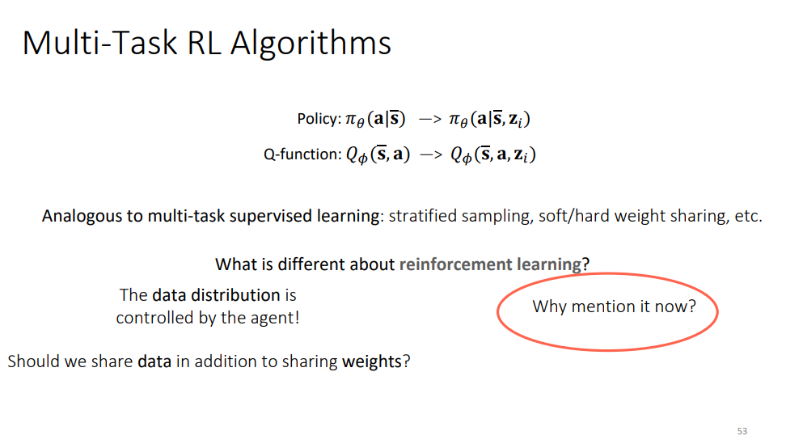

이 장부터 Multi-Task RL에 대해서 다룬다고 합니다.

Multi-task RL algorithm 측면에서, policy, Q function등 s를 이용하는 함수들을 task identifier가 augment된 s를 이용해서 중앙의 식들과 같이 표현할 수 있다고 합니다.

그 다음은 multi-task supervised learning과 비슷하게, 여러 trick들을 사용할 수 있다고 합니다.
* stratified sampling
* soft/hard weight sharing
* etc

그러나, RL에서는 다른 점이 있다고는 합니다!
먼저, data distribution이 agent에 의해 control된다는 점!

그래서, 이러한 아이디어가 나왔다고 합니다. weight sharing을 하는 것 처럼, *data sharing*을 할 수는 없을까?

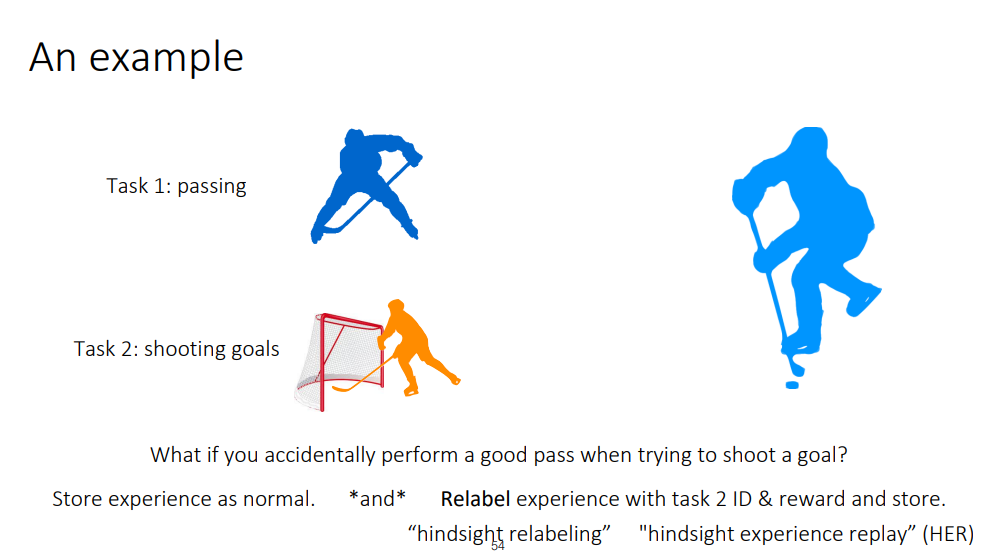

이 장에서는 다른 task들 사이에서 data를 어떻게 재사용 할 수 있을지에 대해서 논한다고 합니다.

예시로써, 하키에 대해서 패싱, 슈팅 두 가지 태스크를 배우는 상황을 카롤 교수는 들었습니다.

이 때, 만약 슈팅을 했는데 이게 좋은 패스로 이어 졌다면?!
* 이를 패스로 다시 라벨링해서 reward 계산하고 저장하면 흐흐.. 쓸모 있는 경험이 되는 것이지요

이를 Hindsight relabeling이라고 하며 HER에서 제안된 방법론이라고 합니다.

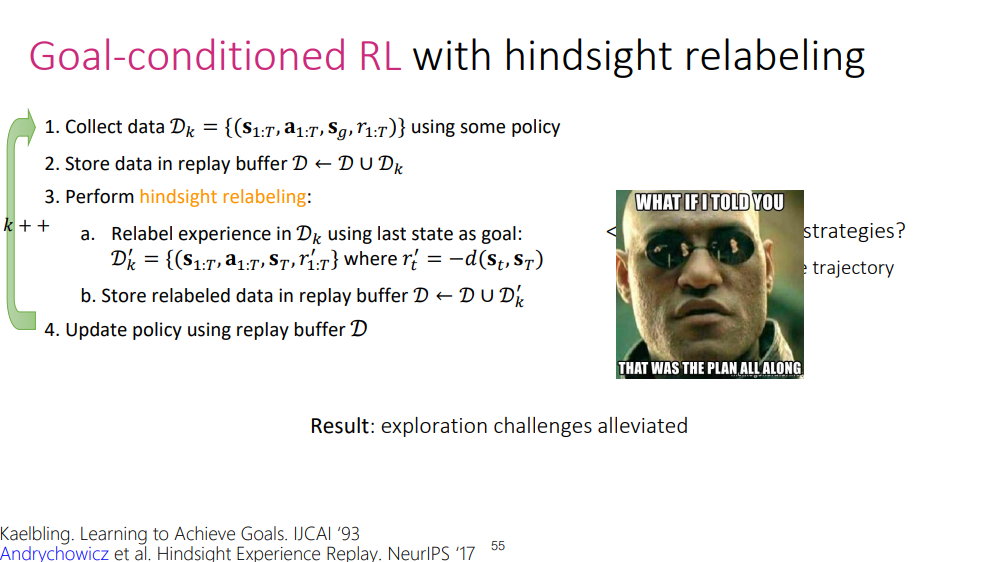

이 장에서는 해당 Hindsight relabeling을 이용한 학습이 어떤 방식으로 이루어지는지에 대해서 설명을 수행하고 있습니다.

1. 정책을 이용한 data 수집
2. replay buffer D에 수집한 data D_k를 합치기
3. hindsight relabeling수행
  * 이때, relabel은 last state를 기존의 goal 대신 새로운 goal로써 가정하여 진행이 된다고 합니다. => 즉, 최종적으로 도착한 곳을 목적지로로 봐줄께! 느낌인 것 같습니다.
4. 이렇게 업데이트된 replay buffer를 통해 policy를 업데이트

카롤 교수님은 이때, last state뿐만 아니라 어떤 state라도 pseudo goal이 될 수 있다고 합니다.

이를 통해, 더욱 많은 경험들을 얻을 수 있으며, 탐험의 어려움이 완화 될 수 있다는 효과를 얘기해 주기도 하시는 것 같습니다.

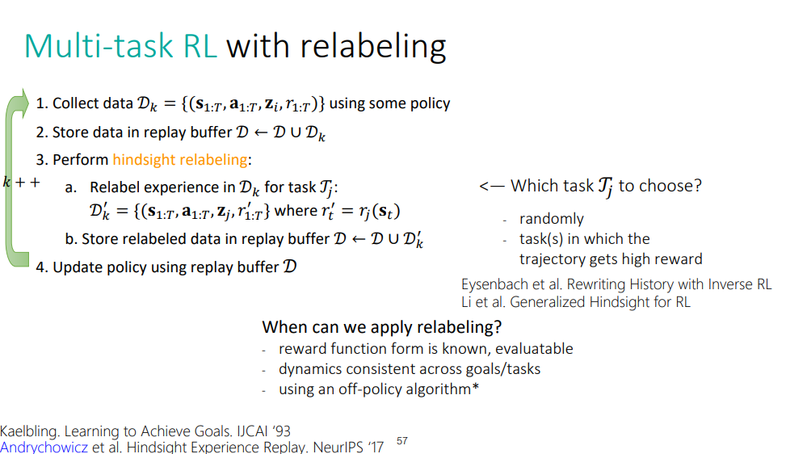

이 장에서는, multi-task RL에서 어떻게 relabeling이 가능할까에 대한 얘기를 다루는 것 같습니다.

1. 정책을 이용한 data를 수집
2. replay buffer D에 수집한 data D_k를 합치기
3. hindsight relableing 수행
  * experience를 task T_j에 대해서 relabeling. 이때 기존의 reward대신 task j의 reward r_j(s_t)를 적용.
4. 이렇게 업데이트된 replay buffer를 통해 policy를 업데이트

task별로 달라지는 reward에 대해서 relabeling을 해주는 점이 goal-conditioned RL에서의 relabeling과 다른 것 같습니다!

카롤 교수님은 이때, 어떤 task T_j를 선택하는 것이 좋을지에 대한 전략에 대해서도 앞서 last state를 고를때 처럼 언급해 주시고 계십니다. 임의로? high reward를 얻은 친구로?.? 이와 관련하여 슬라이드의 논문 두 개를 언급해 주셨습니다.
